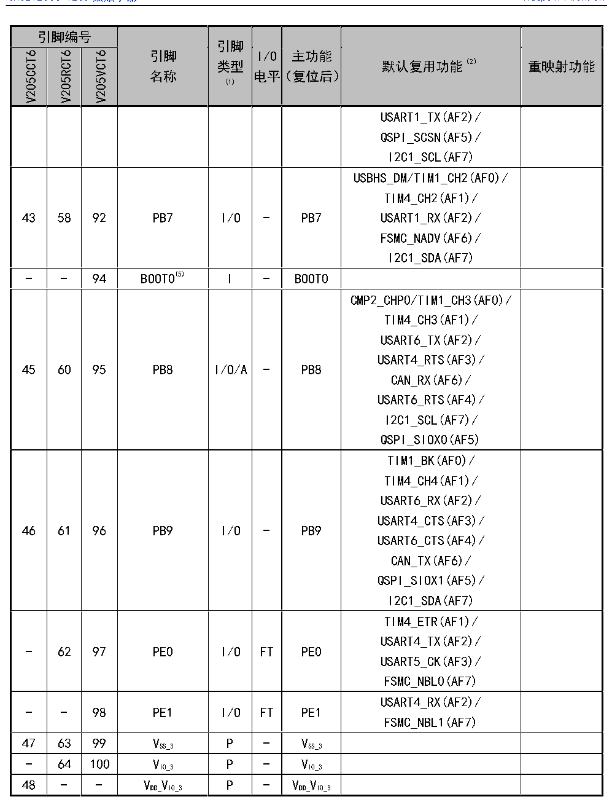

<!-- source-page: 24 -->

[← p.23](0023.md) · [index](../README.md) · [PDF p.24](https://ch32-riscv-ug.github.io/CH32V205/datasheet_zh/CH32V205DS0.PDF#page=24) · [p.25 →](0025.md)

<!-- header: CH32V205、V203数据手册 https://wch.cn -->

 <!-- p24-cluster-01 uncaptioned graphics, rendered from the PDF; verify at https://ch32-riscv-ug.github.io/CH32V205/datasheet_zh/CH32V205DS0.PDF#page=24 -->

🖼 Text parsed from the figure above

> ⬆ **Table continued** — rendered in full at [page 17](0017.md). <!-- p24-table-001 -->

注1：表格缩写解释：  
I = TTL/CMOS 电平斯密特输入；O = CMOS 电平三态输出；  
A = 模拟信号输入或输出；P = 电源；FT = 耐受5V；  
注2：I/O引脚通过一个复用器连接到板载外设/模块，该复用器一次仅允许一个外设的复用功能(AF)连  
接到I/O引脚。该复用器采用多达8路复用功能输入（AF0到AF7），可通过GPIOx_AFLR和GPIOx_AFHR  
寄存器对这些输入进行配置：复位后，复用器选择为复用功能0，即(AF0)。更多详细信息请参考  
《CH32V205RM》手册的复用功能I/O章节。  
<!-- image: p24-draw-image-00001 bbox=[502.92, 779.28, 522.36, 789.6] -->
<!-- footer: V1.3 22 -->
