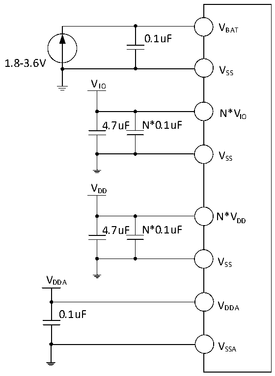

<!-- source-page: 38 -->

[← p.37](0037.md) · [index](../README.md) · [PDF p.38](https://ch32-riscv-ug.github.io/CH32V205/datasheet_zh/CH32V205DS0.PDF#page=38) · [p.39 →](0039.md)

<!-- header: CH32V205、V203数据手册 https://wch.cn -->

# 第 3 章 电气特性

## 3.1 测试条件

除非特殊说明和标注，所有电压都以Vss 为基准。  
所有最小值和最大值将在最坏的环境温度、供电电压和时钟频率条件下得到保证。  
CH32V205的典型数值是基于常温25℃和VDD= VDDA= VIO= 3.3V环境下用于设计指导。  
CH32V203的典型数值是基于常温25℃和VDD_IO V = VDDA= 3.3V环境下用于设计指导。  
对于通过综合评估、设计模拟或工艺特性得到的数据，不会在生产线进行测试。在综合评估的基  
础上，最小和最大值是通过样本测试后统计得到。除非特殊说明为实测值，否则特性参数以综合评估  
或设计保证。  
供电方案：  

图3-1-1 CH32V205常规供电典型电路  
 <!-- rendered from the PDF; verify at https://ch32-riscv-ug.github.io/CH32V205/datasheet_zh/CH32V205DS0.PDF#page=38 -->

🖼 Text parsed from the figure above

VBAT  
0.1uF  
1.8-3.6V  
VSS  
VIO  
N*VIO  
4.7uF N*0.1uF  
VSS  
VDD  
N*VDD  
4.7uF N*0.1uF  
VSS  
VDDA  
VDDA  
0.1uF  
VSSA  

注：VDD、VIO 在部分芯片封装中可能有多个引脚，同名电源引脚必须短接。  
VDD 引脚各外接0.1uF容量的退耦电容，整个VDD 电源建议再并联一个4.7uF容量的退耦电容。  
VIO 引脚各外接0.1uF容量的退耦电容，整个VIO 电源建议再并联一个4.7uF容量的退耦电容。  
<!-- image: p38-draw-image-00001 bbox=[502.92, 779.28, 522.36, 789.6] -->
<!-- footer: V1.3 36 -->
