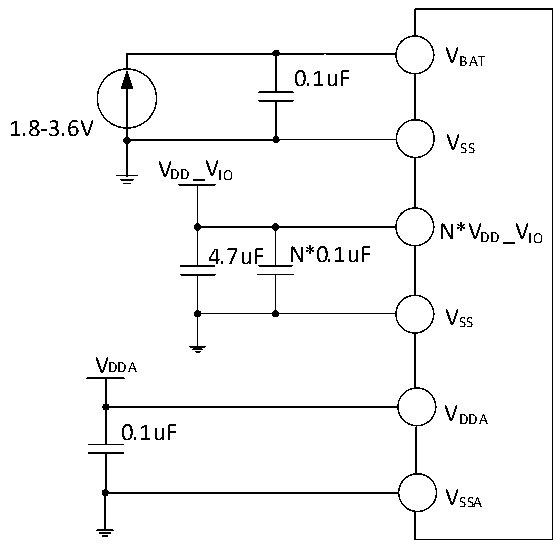

<!-- source-page: 39 -->

[← p.38](0038.md) · [index](../README.md) · [PDF p.39](https://ch32-riscv-ug.github.io/CH32V205/datasheet_zh/CH32V205DS0.PDF#page=39) · [p.40 →](0040.md)

<!-- header: CH32V205、V203数据手册 https://wch.cn -->

图3-1-2 CH32V203常规供电典型电路  
 <!-- rendered from the PDF; verify at https://ch32-riscv-ug.github.io/CH32V205/datasheet_zh/CH32V205DS0.PDF#page=39 -->

🖼 Text parsed from the figure above

VBAT  
0.1uF  
1.8-3.6V  
VSS  
VDD_VIO  
N*VDD_VIO  
4.7uF N*0.1uF  
VSS  
VDDA  
VDDA  
0.1uF  
VSSA  

注：VDD_IO V 在部分芯片封装中可能有多个引脚，同名电源引脚必须短接。  
VDD_IO V 引脚各外接0.1uF容量的退耦电容，整个VDD_IO V 电源建议再并联一个4.7uF容量的退耦电容。  

## 3.2 绝对最大值

临界或者超过绝对最大值将可能导致芯片工作不正常甚至损坏。  

<!-- p39-table-001 (table-3-1@1) -->
<table><caption>表3-1 绝对最大值参数表</caption><tr><th>符号</th><th>描述</th><th>最小值</th><th>最大值</th><th>单位</th></tr><tr><td style="text-align:left">TA</td><td>工作时的环境温度</td><td>-40</td><td>85</td><td>℃</td></tr><tr><td style="text-align:left">TS</td><td>存储时的环境温度</td><td>-40</td><td>125</td><td>℃</td></tr><tr><td style="text-align:left">V -V DD SS</td><td style="text-align:left">外部主供电电压（包含V 、V 、V 、V 、V ） DDA DD BAT REF+ IO</td><td>-0.3</td><td>4.0</td><td>V</td></tr><tr><td rowspan="2" style="text-align:left">VIN</td><td>FT（耐受5V）引脚上的输入电压</td><td style="text-align:left">V -0.3SS</td><td>5.5</td><td>V</td></tr><tr><td>其他引脚上的电压</td><td style="text-align:left">V -0.3SS</td><td style="text-align:left">V +0.3DD</td><td>V</td></tr><tr><td style="text-align:left">|△V | DD_x</td><td style="text-align:left">主供电引脚各V 之间的电压差DD</td><td></td><td>20</td><td>mV</td></tr><tr><td style="text-align:left">|△V | SS_x</td><td>不同接地引脚之间的电压差</td><td></td><td>20</td><td>mV</td></tr><tr><td rowspan="2" style="text-align:left">VESD(HBM)</td><td>普通I/O引脚的ESD静电放电电压（HBM）</td><td>4K</td><td></td><td>V</td></tr><tr><td>USB引脚的ESD静电放电电压（HBM）</td><td>4K</td><td></td><td>V</td></tr><tr><td style="text-align:left">IVDD</td><td style="text-align:left">经过V 、V 、V 电源线的总电流（供应电流） DDA DD IO</td><td></td><td>250</td><td>mA</td></tr><tr><td style="text-align:left">IVss</td><td style="text-align:left">经过V 地线的总电流（流出电流） SS</td><td></td><td>250</td><td>mA</td></tr><tr><td rowspan="2" style="text-align:left">IIO</td><td>任意I/O和控制引脚上的灌电流</td><td></td><td>25</td><td>mA</td></tr><tr><td>任意I/O和控制引脚上的源电流</td><td></td><td>-25</td><td>mA</td></tr><tr><td rowspan="3" style="text-align:left">IINJ(PIN)</td><td>NRST引脚注入电流</td><td></td><td>±5</td><td>mA</td></tr><tr><td>HSE的OSC_IN引脚和LSE的OSC_IN引脚注入电流</td><td></td><td>±5</td><td>mA</td></tr><tr><td>其他引脚的注入电流</td><td></td><td>±5</td><td>mA</td></tr><tr><td style="text-align:left">∑IINJ(PIN)</td><td>所有I/O和控制引脚的总注入电流</td><td></td><td>±25</td><td>mA</td></tr></table>

<!-- image: p39-draw-image-00001 bbox=[502.92, 779.28, 522.36, 789.6] -->
<!-- footer: V1.3 37 -->
