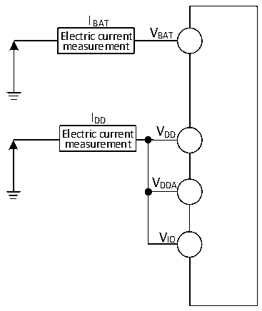

<!-- source-page: 41 -->

[← p.40](0040.md) · [index](../README.md) · [PDF p.41](https://ch32-riscv-ug.github.io/CH32V205/datasheet_zh/CH32V205DS0.PDF#page=41) · [p.42 →](0042.md)

<!-- header: CH32V205、V203数据手册 https://wch.cn -->

> ⬆ **Table continued** — rendered in full at [page 40](0040.md). <!-- p41-table-001 -->

注：1.设计参数；  
2.常温测试值。  

### 3.3.3 内置的参考电压

<!-- p41-table-002 (table-3-5@1) -->
<table><caption>表3-5 内置参考电压</caption><tr><th>符号</th><th>参数</th><th>条件</th><th>最小值</th><th>典型值</th><th>最大值</th><th>单位</th></tr><tr><td style="text-align:left">VREFINT</td><td>内置参考电压</td><td style="text-align:left">T = -40℃～85℃ A</td><td>1.19</td><td>1.22</td><td>1.25</td><td>V</td></tr><tr><td style="text-align:left">TS_vrefint</td><td style="text-align:left">当读出内部参考电压时， ADC的采样时间</td><td>建议慢速采样</td><td></td><td></td><td>20</td><td>us</td></tr></table>

### 3.3.4 供电电流特性

电流消耗是多种参数和因素的综合指标，这些参数和因素包括工作电压、环境温度、I/O 引脚的  
负载、产品的软件配置、工作频率、I/O 脚的翻转速率、程序在存储器中的位置以及执行的代码等。  
电流消耗测量方法如下图：  

图3-2-1 CH32V205电流消耗测量  
 <!-- rendered from the PDF; verify at https://ch32-riscv-ug.github.io/CH32V205/datasheet_zh/CH32V205DS0.PDF#page=41 -->

🖼 Text parsed from the figure above

IBAT  
V  
Electric current BAT  
measurement  
IDD  
Electric current V DD  
measurement  
VDDA  
VIO  

CH32V205处于下列条件：  
常温 VDD= VDDA= VIO= 3.3V 情况下，测试时：所有 I/O 引脚配置为下拉输入，运行于高速内部  
RC振荡器HSI，HSI = 8M，FPLCK1= FHCLK/2，FPLCK2= FHCLK，使能或关闭所有外设时钟的功耗。  
注：小封装型号未封装出的引脚或者已封装出来但未使用的引脚，建议配置为上拉输入或者下拉输入，  
否则可能影响电流指标，具体操作请参考EVT低功耗例程。  
<!-- image: p41-draw-image-00001 bbox=[502.92, 779.28, 522.36, 789.6] -->
<!-- footer: V1.3 39 -->
