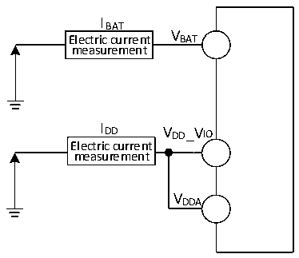

<!-- source-page: 42 -->

[← p.41](0041.md) · [index](../README.md) · [PDF p.42](https://ch32-riscv-ug.github.io/CH32V205/datasheet_zh/CH32V205DS0.PDF#page=42) · [p.43 →](0043.md)

<!-- header: CH32V205、V203数据手册 https://wch.cn -->

图3-2-2 CH32V203电流消耗测量  
 <!-- rendered from the PDF; verify at https://ch32-riscv-ug.github.io/CH32V205/datasheet_zh/CH32V205DS0.PDF#page=42 -->

🖼 Text parsed from the figure above

IBAT  
Electric current VBAT  
measurement  
IDD V  
_VIO  
DD  
Electric current  
measurement  
VDDA  

CH32V203处于下列条件：  
常温 VDD_IO V = VDDA= 3.3V 情况下，测试时：所有 I/O 引脚配置为下拉输入，运行于高速内部 RC  
振荡器HSI，HSI = 8M，FPLCK1= FHCLK/2，FPLCK2= FHCLK，使能或关闭所有外设时钟的功耗。  

<!-- p42-table-001 (table-3-6@1) -->
<table><caption>表3-6 数据处理代码从FLASH中运行，设置LDOTRIM[1:0]=10b（默认值）、LDO_EC=0</caption><tr><th rowspan="2">符号</th><th rowspan="2">参数</th><th colspan="3">条件</th><th colspan="2">典型值</th><th rowspan="2">单位</th></tr><tr><td>HSILP</td><td>PLLON</td><td style="text-align:left">FHCLK</td><td>使能所有外设</td><td>关闭所有外设</td></tr><tr><td rowspan="10" style="text-align:left">I (1) DD</td><td rowspan="5" style="text-align:left">运行模式下的供应电流</td><td>0</td><td>1</td><td>192MHz</td><td>21.4</td><td>12.6</td><td rowspan="5">mA</td></tr><tr><td>0</td><td>1</td><td>160MHz</td><td>19.8</td><td>11.1</td></tr><tr><td>0</td><td>1</td><td>96MHz</td><td>11.5</td><td>7.1</td></tr><tr><td>0</td><td>0</td><td>8MHz</td><td>2.1</td><td>1.7</td></tr><tr><td>1</td><td>0</td><td>1MHz</td><td>1.3</td><td>1.2</td></tr><tr><td rowspan="5" style="text-align:left">睡眠模式下的供应电流（此时外设供电和时钟保持）</td><td>0</td><td>1</td><td>192MHz</td><td>13.8</td><td>5.1</td><td rowspan="5">mA</td></tr><tr><td>0</td><td>1</td><td>160MHz</td><td>13.4</td><td>4.6</td></tr><tr><td>0</td><td>1</td><td>96MHz</td><td>7.7</td><td>3.3</td></tr><tr><td>0</td><td>0</td><td>8MHz</td><td>1.9</td><td>1.5</td></tr><tr><td>1</td><td>0</td><td>1MHz</td><td>1.2</td><td>1.1</td></tr></table>

注：1.以上均为实测参数。  

<!-- p42-table-002 (table-3-7@1) -->
<table><caption>表3-7 数据处理代码从SRAM中运行，FLASH进入低功耗模式（1），设置LDOTRIM[1:0]=01b、LDO_EC=0</caption><tr><th rowspan="2">符号</th><th rowspan="2">参数</th><th colspan="3">条件</th><th colspan="2">典型值</th><th rowspan="2">单位</th></tr><tr><td>HSILP</td><td>PLLON</td><td style="text-align:left">FHCLK</td><td>使能所有外设</td><td>关闭所有外设</td></tr><tr><td rowspan="10" style="text-align:left">I (2) DD</td><td rowspan="5" style="text-align:left">运行模式下的供应电流</td><td>0</td><td>1</td><td>192MHz</td><td>20.3</td><td>11.3</td><td rowspan="5">mA</td></tr><tr><td>0</td><td>1</td><td>160MHz</td><td>19.3</td><td>11.1</td></tr><tr><td>0</td><td>1</td><td>96MHz</td><td>10.6</td><td>6.4</td></tr><tr><td>0</td><td>0</td><td>8MHz</td><td>1.1</td><td>0.7</td></tr><tr><td>1</td><td>0</td><td>1MHz</td><td>0.2</td><td>0.2</td></tr><tr><td rowspan="5" style="text-align:left">睡眠模式下的供应电流（此时外设供电和时钟保持）</td><td>0</td><td>1</td><td>192MHz</td><td>11.5</td><td>3.8</td><td rowspan="5">mA</td></tr><tr><td>0</td><td>1</td><td>160MHz</td><td>11.2</td><td>3.3</td></tr><tr><td>0</td><td>1</td><td>96MHz</td><td>6.3</td><td>2.2</td></tr><tr><td>0</td><td>0</td><td>8MHz</td><td>0.8</td><td>0.4</td></tr><tr><td>1</td><td>0</td><td>1MHz</td><td>0.2</td><td>0.2</td></tr></table>

注：1.当FLASH_LP_REG=1且FLASH_LP[11:10]=10b时，FLASH进入低功耗模式。  
<!-- image: p42-draw-image-00001 bbox=[502.92, 779.28, 522.36, 789.6] -->
<!-- footer: V1.3 40 -->
