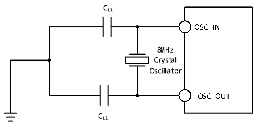
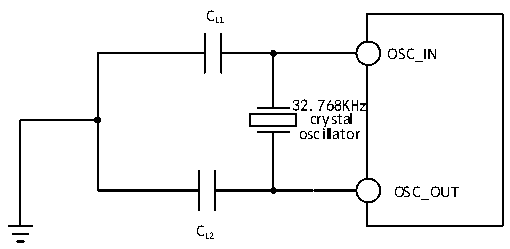

<!-- source-page: 45 -->

[← p.44](0044.md) · [index](../README.md) · [PDF p.45](https://ch32-riscv-ug.github.io/CH32V205/datasheet_zh/CH32V205DS0.PDF#page=45) · [p.46 →](0046.md)

<!-- header: CH32V205、V203数据手册 https://wch.cn -->

> ⬆ **Table continued** — rendered in full at [page 44](0044.md). <!-- p45-table-001 -->

注：1.建议晶体ESR不超过80欧姆，优先选择ESR较小的晶体，负载电容参考晶体手册要求。  
2.启动时间指从HSEON开启到HSERDY被置位的时间差。  
电路参考设计及要求：  
晶体的负载电容以晶体厂商建议为准，通常情况CL1=CL2。  

图3-5 外接8M晶体典型电路  
 <!-- rendered from the PDF; verify at https://ch32-riscv-ug.github.io/CH32V205/datasheet_zh/CH32V205DS0.PDF#page=45 -->

🖼 Text parsed from the figure above

CL1  
OSC_IN  
8MHz  
Crystal  
Oscillator  
OSC_OUT  
CL2  

<!-- p45-table-002 (table-3-12@1) -->
<table><caption>表3-12 使用一个晶体/陶瓷谐振器产生的低速外部时钟（fLSE=32.768KHz）</caption><tr><th>符号</th><th>参数</th><th>条件</th><th>最小值</th><th>典型值</th><th>最大值</th><th>单位</th></tr><tr><td style="text-align:left">RF</td><td>反馈电阻</td><td></td><td></td><td>5</td><td></td><td>MΩ</td></tr><tr><td style="text-align:left">C /C L1 L2</td><td style="text-align:left">建议的负载电容与对应晶体串行阻抗RS</td><td style="text-align:left">R = 70KΩS</td><td></td><td></td><td>15</td><td>pF</td></tr><tr><td style="text-align:left">i 2</td><td>LSE驱动电流</td><td style="text-align:left">V = 3.3VDD</td><td></td><td>0.36</td><td></td><td>uA</td></tr><tr><td style="text-align:left">g m</td><td>振荡器的跨导</td><td>启动</td><td></td><td>26</td><td></td><td>uA/V</td></tr><tr><td style="text-align:left">t SU(LSE)</td><td>启动时间(1)</td><td style="text-align:left">V 是稳定的DD</td><td></td><td>1000</td><td></td><td>ms</td></tr></table>

注：1.启动时间指从LSEON开启到LSERDY被置位的时间差。  
电路参考设计及要求：  
晶体的负载电容以晶体厂商建议为准，通常情况CL1= CL2，可选12pF左右。  

图3-6 外接32.768K晶体典型电路  
 <!-- rendered from the PDF; verify at https://ch32-riscv-ug.github.io/CH32V205/datasheet_zh/CH32V205DS0.PDF#page=45 -->

🖼 Text parsed from the figure above

CL1  
OSC_IN  
32.768KHz  
crystal  
oscillator  
OSC_OUT  
CL2  

注：负载电容CL由下式计算：CL= CL1 x CL2/ (CL1+ CL2) + Cstray，其中Cstray 是引脚的电容和PCB板或  
<!-- image: p45-draw-image-00001 bbox=[502.92, 779.28, 522.36, 789.6] -->
<!-- footer: V1.3 43 -->
