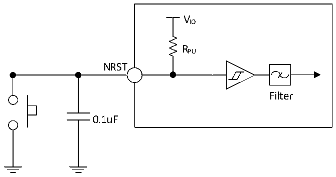

<!-- source-page: 49 -->

[← p.48](0048.md) · [index](../README.md) · [PDF p.49](https://ch32-riscv-ug.github.io/CH32V205/datasheet_zh/CH32V205DS0.PDF#page=49) · [p.50 →](0050.md)

> ⚠ 21 subscript glyph(s) on this page appear as `*` because the PDF's text layer maps them to `*` (broken ToUnicode); the printed page shows the real subscripts -- read [the PDF, p.49](https://ch32-riscv-ug.github.io/CH32V205/datasheet_zh/CH32V205DS0.PDF#page=49).

<!-- header: CH32V205、V203数据手册 https://wch.cn -->

> ⬆ **Table continued** — rendered in full at [page 48](0048.md). <!-- p49-table-001 -->

注：1.上表中V*根据具体的引脚可表示为VIO 或VDD。  
2.USB接口I/O仅符合MODEx[1:0]=10b项参数。  
3.PC13、PC14和PC15作为GPIO输出脚时只能工作在2MHz以下，最大驱动负载为30pF。  

### 3.3.11 NRST引脚特性

电路参考设计及要求：  

图3-7 外部复位引脚典型电路  
 <!-- rendered from the PDF; verify at https://ch32-riscv-ug.github.io/CH32V205/datasheet_zh/CH32V205DS0.PDF#page=49 -->

🖼 Text parsed from the figure above

VIO  
RPU  
NRST  
Filter  
0.1uF  

注：图中的电容是可选的，可以用于滤除按键抖动。  

<!-- p49-table-003 (table-3-22@1) pages 49-50 -->
<table><caption>表3-22 外部复位引脚特性</caption><tr><th>符号</th><th>参数</th><th>条件</th><th>最小值</th><th>典型值</th><th>最大值</th><th>单位</th></tr><tr><td style="text-align:left">VIL(NRST)</td><td>NRST输入低电平电压</td><td></td><td>-0.3</td><td></td><td style="text-align:left">0.32*V -0.16IO</td><td>V</td></tr><tr><td style="text-align:left">VIH(NRST)</td><td>NRST输入高电平电压</td><td></td><td style="text-align:left">0.41*V +0.53IO</td><td></td><td style="text-align:left">V +0.3IO</td><td>V</td></tr><tr><td style="text-align:left">V hys(NRST)</td><td>NRST施密特触发器电压迟滞</td><td></td><td></td><td>220</td><td></td><td>mV</td></tr><tr><td style="text-align:left">R (1) PU</td><td>上拉等效电阻</td><td></td><td>30</td><td>40</td><td>50</td><td>kΩ</td></tr><tr><td style="text-align:left">VF(NRST)</td><td>NRST输入可被滤波脉宽</td><td></td><td></td><td></td><td>100</td><td>ns</td></tr><tr><td style="text-align:left">VNF(NRST)</td><td>NRST输入无法滤波脉宽</td><td></td><td>300</td><td></td><td></td><td>ns</td></tr></table>

<!-- image: p49-draw-image-00001 bbox=[502.92, 779.28, 522.36, 789.6] -->
<!-- footer: V1.3 47 -->
