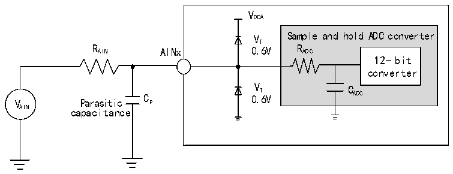
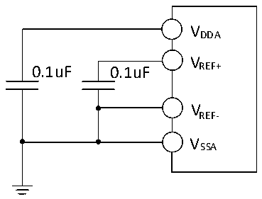

<!-- source-page: 56 -->

[← p.55](0055.md) · [index](../README.md) · [PDF p.56](https://ch32-riscv-ug.github.io/CH32V205/datasheet_zh/CH32V205DS0.PDF#page=56) · [p.57 →](0057.md)

<!-- header: CH32V205、V203数据手册 https://wch.cn -->

图3-12 ADC典型连接图  
 <!-- rendered from the PDF; verify at https://ch32-riscv-ug.github.io/CH32V205/datasheet_zh/CH32V205DS0.PDF#page=56 -->

🖼 Text parsed from the figure above

VDDA  
V Sample and hold ADC converter  
T  
R AIN AINx 0.6V R ADC  
12-bit  
converter  
V Parasitic C P 0 V . T 6V C ADC  
AIN capacitance  

Cp 表示PCB与焊盘上的寄生电容（大约5pF），可能与焊盘和PCB布局质量有关。较大的Cp 数值将  
降低转换精度，解决办法是降低fADC 值。  

图3-13 模拟电源及退耦电路参考  
 <!-- rendered from the PDF; verify at https://ch32-riscv-ug.github.io/CH32V205/datasheet_zh/CH32V205DS0.PDF#page=56 -->

🖼 Text parsed from the figure above

VDDA  
V  
0.1uF 0.1uF REF+  
VREF-  
VSSA  

### 3.3.18 温度传感器特性

<!-- p56-table-001 (table-3-31@1) -->
<table><caption>表3-31 温度传感器特性</caption><tr><th>符号</th><th>参数</th><th>条件</th><th>最小值</th><th>典型值</th><th>最大值</th><th>单位</th></tr><tr><td style="text-align:left">RTS</td><td>温度传感器测量范围</td><td></td><td>-40</td><td></td><td>85</td><td></td></tr><tr><td style="text-align:left">ATSC</td><td>温度传感器的测量误差</td><td></td><td></td><td>±12</td><td></td><td></td></tr><tr><td>Avg_Slope</td><td>平均斜率（负温度系数）</td><td></td><td>3.8</td><td>4.3</td><td>4.8</td><td>mV/℃</td></tr><tr><td style="text-align:left">V25</td><td>在25℃时的电压</td><td></td><td>1.35</td><td>1.43</td><td>1.5</td><td>V</td></tr><tr><td style="text-align:left">TS_temp</td><td>当读取温度时，ADC采样时间</td><td style="text-align:left">f = 8MHz ADC</td><td></td><td></td><td>20</td><td>us</td></tr></table>

### 3.3.19 OPA特性

<!-- p56-table-002 (table-3-32-1@1) pages 56-57 -->
<table><caption>表3-32-1 OPA运放特性</caption><tr><th>符号</th><th>参数</th><th>条件</th><th>最小值</th><th>典型值</th><th>最大值</th><th>单位</th></tr><tr><td style="text-align:left">VDDA</td><td>供电电压</td><td>建议不低于2V</td><td>1.8</td><td>3.3</td><td>3.6</td><td>V</td></tr><tr><td style="text-align:left">VCM</td><td>共模输入电压</td><td></td><td>0</td><td></td><td style="text-align:left">VDDA</td><td>V</td></tr><tr><td rowspan="2" style="text-align:left">VIOFFSET</td><td>输入失调电压（OPA1）</td><td>校准后</td><td></td><td>±0.2</td><td></td><td>mV</td></tr><tr><td>输入失调电压（OPA2）</td><td>校准后</td><td></td><td>±0.9</td><td></td><td>mV</td></tr><tr><td style="text-align:left">ILOAD</td><td>驱动电流</td><td style="text-align:left">R = 4kΩLOAD</td><td></td><td></td><td>900</td><td>uA</td></tr><tr><td style="text-align:left">ILOAD_PGA</td><td>PGA模式驱动电流</td><td></td><td></td><td></td><td>500</td><td>uA</td></tr><tr><td style="text-align:left">IDDOPAMP</td><td>消耗电流</td><td>无负载，静态模式</td><td></td><td>550</td><td></td><td>uA</td></tr><tr><td>CMRR(1)</td><td>共模抑制比</td><td>@1kHz</td><td></td><td>115</td><td></td><td>dB</td></tr><tr><td>PSRR(1)</td><td>电源抑制比</td><td>@1kHz</td><td></td><td>81</td><td></td><td>dB</td></tr><tr><td>Av(1)</td><td>开环增益</td><td style="text-align:left">C = 5pFLOAD</td><td></td><td>115</td><td></td><td>dB</td></tr><tr><td style="text-align:left">G (1) BW</td><td>单位增益带宽</td><td style="text-align:left">C = 5pFLOAD</td><td></td><td>14</td><td></td><td>MHz</td></tr><tr><td style="text-align:left">P(1) M</td><td>相位裕度</td><td style="text-align:left">C = 5pFLOAD</td><td></td><td>75</td><td></td><td>°</td></tr><tr><td style="text-align:left">S(1) R</td><td>压摆率</td><td style="text-align:left">C = 5pFLOAD</td><td>10</td><td>12</td><td>14</td><td>V/us</td></tr><tr><td style="text-align:left">t (1) WAKUP</td><td>关闭到唤醒时间，0.1%</td><td style="text-align:left">输入V /2， DDA C = 50pF，R = 4kΩ LOAD LOAD</td><td></td><td>0.2</td><td></td><td>us</td></tr><tr><td style="text-align:left">RLOAD</td><td>阻性负载</td><td></td><td>4</td><td></td><td></td><td>kΩ</td></tr><tr><td style="text-align:left">CLOAD</td><td>容性负载</td><td></td><td></td><td></td><td>50</td><td>pF</td></tr><tr><td rowspan="2" style="text-align:left">V (2) OHSAT</td><td rowspan="2">高饱和输出电压</td><td style="text-align:left">R = 4kΩLOAD</td><td style="text-align:left">V -100DDA</td><td style="text-align:left">V -60DDA</td><td></td><td rowspan="2">mV</td></tr><tr><td style="text-align:left">R = 20kΩLOAD</td><td style="text-align:left">V -100DDA</td><td style="text-align:left">V -60DDA</td><td></td></tr><tr><td rowspan="2" style="text-align:left">V (2) OLSAT</td><td rowspan="2">低饱和输出电压</td><td style="text-align:left">R = 4kΩLOAD</td><td></td><td>3</td><td>10</td><td rowspan="2">mV</td></tr><tr><td style="text-align:left">R = 20kΩLOAD</td><td></td><td>3</td><td>10</td></tr><tr><td rowspan="5" style="text-align:left">PGAGain(1)</td><td rowspan="5">内部同相PGA</td><td style="text-align:left">Gain = 4，V &lt;(V /3) INP DDA (OPA2)</td><td>-1</td><td></td><td>1</td><td>%</td></tr><tr><td style="text-align:left">Gain = 8，V &lt;(V /7) INP DDA (OPA1&amp;OPA2)</td><td>-1</td><td></td><td>1</td><td>%</td></tr><tr><td style="text-align:left">Gain = 16，V &lt;(V /15) INP DDA (OPA1&amp;OPA2)</td><td>-1</td><td></td><td>1</td><td>%</td></tr><tr><td style="text-align:left">Gain = 32，V &lt;(V /31) INP DDA (OPA1&amp;OPA2)</td><td>-1</td><td></td><td>1</td><td>%</td></tr><tr><td style="text-align:left">Gain = 64，V &lt;(V /63) INP DDA (OPA1)</td><td>-2</td><td></td><td>2</td><td>%</td></tr><tr><td style="text-align:left">VB</td><td style="text-align:left">PGA模式下建议的直流偏置电压</td><td>PGADIF = 1</td><td>0.2</td><td style="text-align:left">V /2DDA</td><td style="text-align:left">V -0.2DDA</td><td>V</td></tr><tr><td>Delta R</td><td>电阻绝对值变化</td><td></td><td>-15</td><td></td><td>15</td><td>%</td></tr><tr><td rowspan="4">eN(1)</td><td rowspan="2" style="text-align:left">等效输入噪声； 关闭chopper</td><td style="text-align:left">R = 4kΩ@1kHz LOAD</td><td></td><td>105</td><td></td><td rowspan="4" style="text-align:left">nV/ sqrt(Hz)</td></tr><tr><td style="text-align:left">R = 20kΩ@1KHz LOAD</td><td></td><td>105</td><td></td></tr><tr><td rowspan="2" style="text-align:left">等效输入噪声； 开启chopper@1MHz（OPA1）</td><td style="text-align:left">R = 4kΩ@1kHz LOAD</td><td></td><td>28</td><td></td></tr><tr><td style="text-align:left">R = 20kΩ@1KHz LOAD</td><td></td><td>28</td><td></td></tr></table>

<!-- image: p56-draw-image-00001 bbox=[502.92, 779.28, 522.36, 789.6] -->
<!-- footer: V1.3 54 -->
