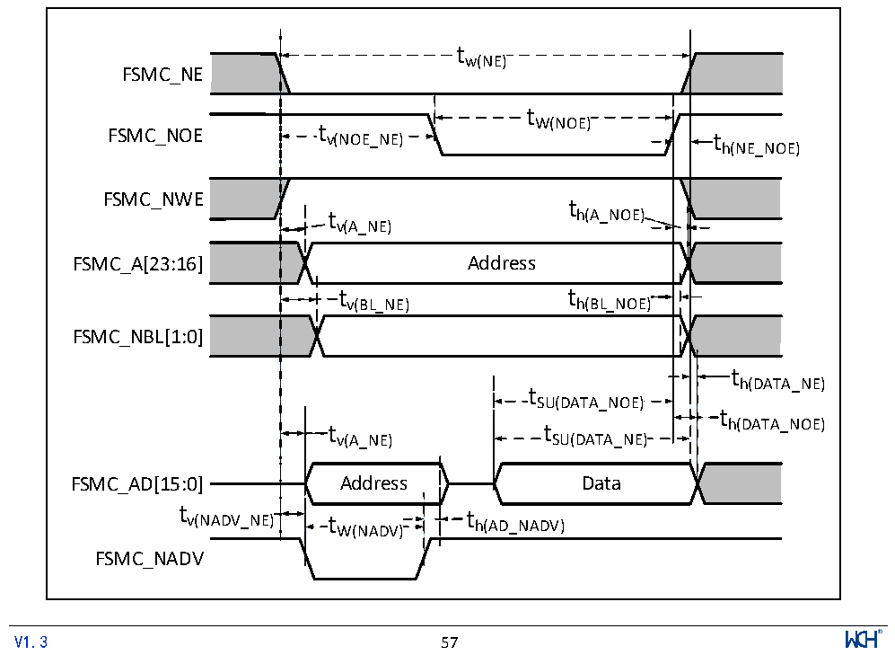

<!-- source-page: 59 -->

[← p.58](0058.md) · [index](../README.md) · [PDF p.59](https://ch32-riscv-ug.github.io/CH32V205/datasheet_zh/CH32V205DS0.PDF#page=59) · [p.60 →](0060.md)

<!-- header: CH32V205、V203数据手册 https://wch.cn -->

> ⬆ **Table continued** — rendered in full at [page 58](0058.md). <!-- p59-table-001 -->

注：1.设计参数。  

<!-- p59-table-002 (table-3-33-2@1) -->
<table><caption>表3-33-2 CMP电压比较器特性（低功耗模式）</caption><tr><th>符号</th><th>参数</th><th>条件</th><th>最小值</th><th>典型值</th><th>最大值</th><th>单位</th></tr><tr><td style="text-align:left">VDDA</td><td>供电电压</td><td></td><td>1.8</td><td>3.3</td><td>3.6</td><td>V</td></tr><tr><td style="text-align:left">VCM</td><td>共模输入电压</td><td></td><td>0</td><td></td><td style="text-align:left">VDDA</td><td>V</td></tr><tr><td style="text-align:left">V (1) IOFFSET</td><td>输入失调电压</td><td></td><td></td><td>±1.5</td><td></td><td>mV</td></tr><tr><td style="text-align:left">IDDCMP</td><td>消耗电流</td><td></td><td></td><td>40</td><td></td><td>uA</td></tr><tr><td rowspan="4" style="text-align:left">V (1) hys</td><td rowspan="4">迟滞电压</td><td>COMP_HYS[1:0] = 00</td><td></td><td>0</td><td></td><td rowspan="4">mV</td></tr><tr><td>COMP_HYS[1:0] = 01</td><td></td><td>±10</td><td></td></tr><tr><td>COMP_HYS[1:0] = 10</td><td></td><td>±20</td><td></td></tr><tr><td>COMP_HYS[1:0] = 11</td><td></td><td>±40</td><td></td></tr><tr><td style="text-align:left">t(1) D</td><td style="text-align:left">比较器延时， VINP从（VINN-100mV） 到（VINN+100mV）变化</td><td style="text-align:left">0≤ V ≤ V INN DDA</td><td></td><td>25</td><td></td><td>ns</td></tr></table>

注：1.设计参数。  

### 3.3.21 FSMC特性

图3-14 异步总线复用PSRAM/NOR读操作波形  
 <!-- rendered from the PDF; verify at https://ch32-riscv-ug.github.io/CH32V205/datasheet_zh/CH32V205DS0.PDF#page=59 -->

🖼 Text parsed from the figure above

tw(NE)  
FSMC_NE  
t  
FSMC_NOE t v(NOE_NE) W(NOE) t  
h(NE_NOE)  
FSMC_NWE  
t  
t h(A_NOE)  
v(A_NE)  
FSMC_A[23:16] Address  
t v(BL_NE)  )  t h(BL_NOE)  )  
FSMC_NBL[1:0]  
th(DATA_NE)  
t SU(DATA_NOE)  t SU(DATA_NE)  
t  
v(A_NE) SU(DATA_NE)  
FSMC_AD[15:0] Address Data  
tv(NADV_NE)t th(AD_NADV)  
W(NADV)  
FSMC_NADV  
<!-- image: p59-draw-image-00001 inside the figure -->
<!-- footer: V1.3 57 -->

