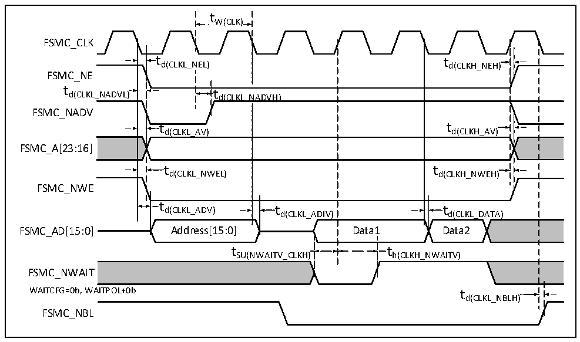

<!-- source-page: 62 -->

[← p.61](0061.md) · [index](../README.md) · [PDF p.62](https://ch32-riscv-ug.github.io/CH32V205/datasheet_zh/CH32V205DS0.PDF#page=62) · [p.63 →](0063.md)

<!-- header: CH32V205、V203数据手册 https://wch.cn -->

> ⬆ **Table continued** — rendered in full at [page 61](0061.md). <!-- p62-table-001 -->

图3-17 同步总线复用PSRAM写波形  
 <!-- rendered from the PDF; verify at https://ch32-riscv-ug.github.io/CH32V205/datasheet_zh/CH32V205DS0.PDF#page=62 -->

🖼 Text parsed from the figure above

tW(CLK)  
FSMC_CLK  
t  t d(CLKL_N  EL)  
td(CLKL_NEL) td(CLKH_NEH)  
FSMC_NE  
td(CLKL_N  NADVH  H)  td(CLKL_N  NADVH)  t d(CLKH_AV)  t d(CLKL_AV)  t  d(CLKL_AV)  t d(CLKH_NWEH)  t  t d(CLKL_ADIV)  t  t d(CLKL_DATA)  Data1  
FSMC_NADV  
FSMC_A[23:16]  
FSMC_NWE  
t h(CLKH_NWAITV)  
tSU(NWAITV_CLKH) th(CLKH_NWAITV)  
t d(CLKL_NBLH)  )  
FSMC_NWAIT  
WAITCFG=0b, WAITPOL+0b t  
FSMC_NBL  

<!-- p62-table-006 (table-3-37@1) -->
<table><caption>表3-37 同步总线复用PSRAM写时序</caption><tr><th>符号</th><th>参数</th><th>最小值</th><th>最大值</th><th>单位</th></tr><tr><td style="text-align:left">t W（CLK）</td><td>FSMC_CLK周期</td><td style="text-align:left">2*t HCLK</td><td></td><td rowspan="15">ns</td></tr><tr><td style="text-align:left">t d（CLKL_NEL）</td><td>FSMC_CLK低至FSMC_NE低</td><td>0</td><td>5</td></tr><tr><td style="text-align:left">t d（CLKH_NEH）</td><td>FSMC_CLK高至FSMC_NE高</td><td style="text-align:left">0.5*t HCLK</td><td style="text-align:left">0.5*t HCLK</td></tr><tr><td style="text-align:left">t d（CLKL_NADVL）</td><td>FSMC_CLK低至FSMC_NADV低</td><td>0</td><td>5</td></tr><tr><td style="text-align:left">t d（CLKL_NADVH）</td><td>FSMC_CLK低至FSMC_NADV高</td><td>0</td><td>5</td></tr><tr><td style="text-align:left">t d（CLKL_AV）</td><td>FSMC_CLK低至FSMC_Ax有效（x = 16…23）</td><td>0</td><td>5</td></tr><tr><td style="text-align:left">t d（CLKH_AIV）</td><td>FSMC_CLK高至FSMC_Ax无效（x = 16…23）</td><td>0</td><td>5</td></tr><tr><td style="text-align:left">t d（CLKL_NWEL）</td><td>FSMC_CLK低至FSMC_NWE低</td><td>0</td><td></td></tr><tr><td style="text-align:left">t d（CLKH_NWEH）</td><td>FSMC_CLK高至FSMC_NWE高</td><td>0</td><td></td></tr><tr><td style="text-align:left">t d（CLKL_ADV）</td><td>FSMC_CLK低至FSMC_AD[15:0]有效</td><td>0</td><td>5</td></tr><tr><td style="text-align:left">t d（CLKL_ADIV）</td><td>FSMC_CLK低至FSMC_AD[15:0]无效</td><td>0</td><td>5</td></tr><tr><td style="text-align:left">t d（CLKL_DATA）</td><td>FSMC_CLK低之后FSMC_AD[15:0]有效</td><td>2</td><td></td></tr><tr><td style="text-align:left">t SU（NWAITV_CLKH）</td><td>FSMC_CLK高之前FSMC_NWAIT有效</td><td>6</td><td></td></tr><tr><td style="text-align:left">t h（CLKH_NWAITV）</td><td>FSMC_CLK高之后FSMC_NWAIT有效</td><td>2</td><td></td></tr><tr><td style="text-align:left">t d（CLKL_NBLH）</td><td>FSMC_CLK低至FSMC_NBL高</td><td>2</td><td></td></tr></table>

NAND控制器波形和时序  
测试条件：NAND操作区域，选择16位数据宽度，使能ECC计算电路，512字节页面大小，其他时序配  
<!-- image: p62-draw-image-00001 bbox=[502.92, 779.28, 522.36, 789.6] -->
<!-- footer: V1.3 60 -->
