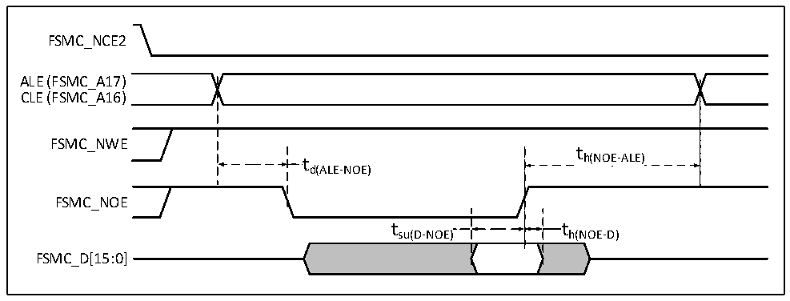
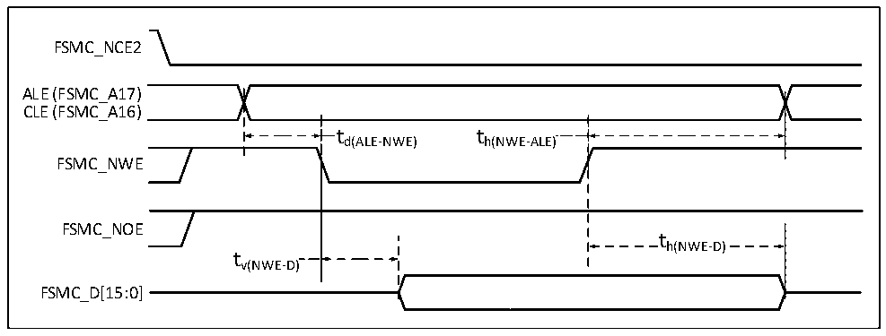
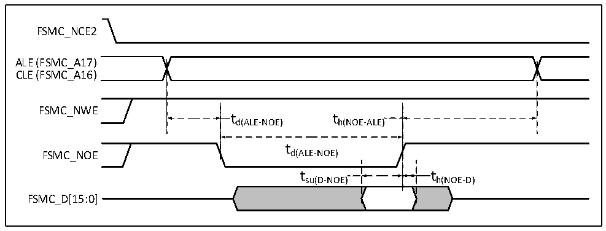

<!-- source-page: 63 -->

[← p.62](0062.md) · [index](../README.md) · [PDF p.63](https://ch32-riscv-ug.github.io/CH32V205/datasheet_zh/CH32V205DS0.PDF#page=63) · [p.64 →](0064.md)

<!-- header: CH32V205、V203数据手册 https://wch.cn -->
置为设置寄存器FSMC_PCR2=0x0002005E，FSMC_PMEM2=0x01020301，FSMC_PATT2=0x01020301。  

图3-18 NAND控制器读操作波形  
 <!-- rendered from the PDF; verify at https://ch32-riscv-ug.github.io/CH32V205/datasheet_zh/CH32V205DS0.PDF#page=63 -->

🖼 Text parsed from the figure above

FSMC_NCE2  
ALE (FSMC_A17)  
CLE (FSMC_A16)  
FSMC_NWE  
t  
t h(NOE-ALE)  
d(ALE-NOE)  
FSMC_NOE  
t su(D-NOE)  )  t h(NOE-D)  )  
FSMC_D[15:0]  

图3-19 NAND控制器写操作波形  
 <!-- rendered from the PDF; verify at https://ch32-riscv-ug.github.io/CH32V205/datasheet_zh/CH32V205DS0.PDF#page=63 -->

🖼 Text parsed from the figure above

FSMC_NCE2  
ALE (FSMC_A17)  
CLE (FSMC_A16)  
t  t d(ALE-NWE)  
t h(NWE-ALE)  )  
FSMC_NWE  
FSMC_NOE  
th(NWE-D)  
tv(NWE-D)  
FSMC_D[15:0]  

图3-20 NAND控制器在通用存储空间的读操作波形  
 <!-- rendered from the PDF; verify at https://ch32-riscv-ug.github.io/CH32V205/datasheet_zh/CH32V205DS0.PDF#page=63 -->

🖼 Text parsed from the figure above

FSMC_NCE2  
ALE (FSMC_A17)  
CLE (FSMC_A16)  
FSMC_NWE  
td(ALE-NOE) th(NOE-ALE)  
t  
FSMC_NOE d(ALE-NOE)  
t su(D-NOE)  )  t h(NOE-D)  )  
FSMC_D[15:0]  

<!-- image: p63-draw-image-00001 bbox=[502.92, 779.28, 522.36, 789.6] -->
<!-- footer: V1.3 61 -->
