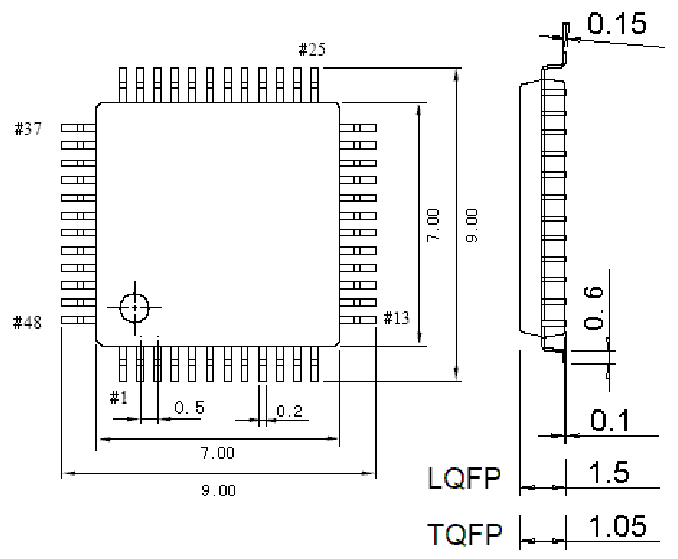
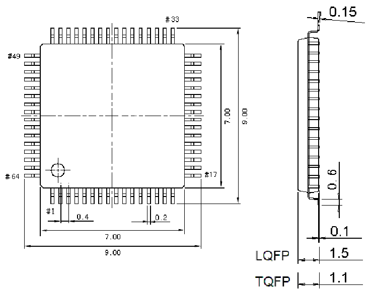

<!-- source-page: 66 -->

[← p.65](0065.md) · [index](../README.md) · [PDF p.66](https://ch32-riscv-ug.github.io/CH32V205/datasheet_zh/CH32V205DS0.PDF#page=66) · [p.67 →](0067.md)

<!-- header: CH32V205、V203数据手册 https://wch.cn -->
说明：尺寸标注的单位是 mm（毫米），引脚中心间距总是标称值，没有误差，除此之外的尺寸误差不  
大于±0.2mm或者±10%两者中的较大值。  

## 4.1 LQFP48封装

 <!-- p66-draw-image-00003 rendered from the PDF -->

## 4.2 LQFP64封装

 <!-- p66-draw-image-00002 rendered from the PDF -->

<!-- image: p66-draw-image-00001 bbox=[502.92, 779.28, 522.36, 789.6] -->
<!-- footer: V1.3 64 -->
