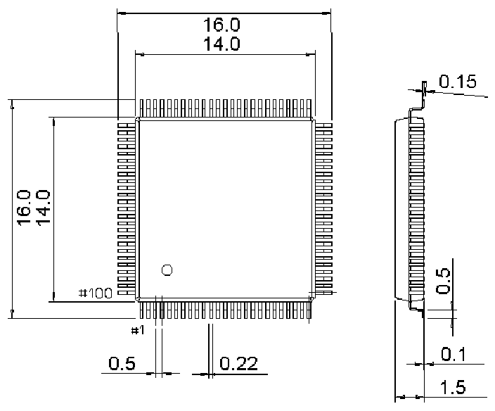

<!-- source-page: 67 -->

[← p.66](0066.md) · [index](../README.md) · [PDF p.67](https://ch32-riscv-ug.github.io/CH32V205/datasheet_zh/CH32V205DS0.PDF#page=67) · [p.68 →](0068.md)

<!-- header: CH32V205、V203数据手册 https://wch.cn -->

## 4.3 LQFP100封装

 <!-- p67-draw-image-00002 rendered from the PDF -->

<!-- image: p67-draw-image-00001 bbox=[502.92, 779.28, 522.36, 789.6] -->
<!-- footer: V1.3 65 -->
