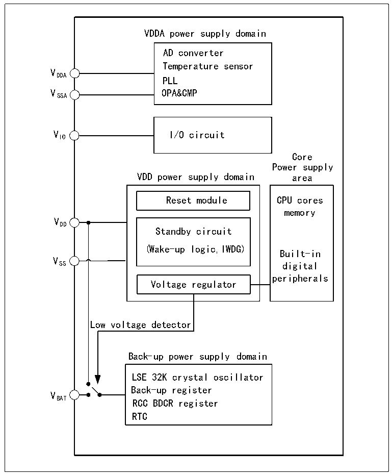

<!-- source-page: 8 -->

[← p.7](0007.md) · [index](../README.md) · [PDF p.8](https://ch32-riscv-ug.github.io/CH32V205/datasheet_en/CH32V205RM.PDF#page=8) · [p.9 →](0009.md)

<!-- header: CH32V205 Reference Manual https://wch-ic.com -->

# Chapter 2 Power Control (PWR)

## 2.1 Overview

The system operating voltage VDD ranges from 1.8 V to 3.6 V, and the built-in voltage regulator provides the  
low-voltage power supply required by the core. When the main power supply VDD is disconnected, a backup  
power source such as a battery can supply power to the real-time clock (RTC) and backup registers via the VBAT  
pin. If a backup power source is not required, it is recommended to connect VDD directly to the VBAT pin.  
The VDDA and VSSA pins are specifically designed to supply power to analog-related circuits in the system,  
including ADCs, temperature sensors, and others.  

Figure 2-1 Block diagram of power supply structure  
 <!-- rendered from the PDF; verify at https://ch32-riscv-ug.github.io/CH32V205/datasheet_en/CH32V205RM.PDF#page=8 -->

🖼 Text parsed from the figure above

VDDA power supply domain  
AD converter  
Temperature sensor  
VDDA  
PLL  
VSSA OPA&amp;CMP  
VIO I/O circuit  
Core  
Power supply  
VDD power supply domain area  
Reset module CPU cores  
memory  
VDD  
Standby circuit  
(Wake-up logic,IWDG)  
Built-in  
V  
SS digital  
peripherals  
Voltage regulator  
Low voltage detector  
Back-up power supply domain  
LSE 32K crystal oscillat or  
Back-up register  
VBAT  
RCC BDCR register  
RTC  

When the main power supply VDD is disconnected, the analog switch switches to VBAT, and the backup area is  
powered by the VBAT pin. At this point, pins PC13 through PC15 cannot be used as GPIOs and are limited to the  
<!-- image: p8-draw-image-00001 bbox=[506.88, 783.6, 525.96, 793.8] -->
<!-- footer: V1.2 6 -->
