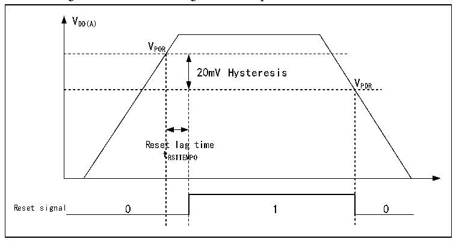

<!-- source-page: 9 -->

[← p.8](0008.md) · [index](../README.md) · [PDF p.9](https://ch32-riscv-ug.github.io/CH32V205/datasheet_en/CH32V205RM.PDF#page=9) · [p.10 →](0010.md)

<!-- header: CH32V205 Reference Manual https://wch-ic.com -->
following functions:  
● PC13 can be used as a TAMPER pin, RTC alarm, or second output.  
● PC14 and PC15 can only be used as LSE pins.  
Once the main power supply VDD has stabilized, the system automatically switches to VDD to power the backup  
area, and pins PC13 through PC15 can be used as GPIOs.  
When pins PC13~PC15 are used as GPIO outputs, the clock speed must be limited to 2MHz or less, the maximum  
load capacitance is 30pF, and they must not be used in applications involving continuous output or current sinking,  
such as LED drivers.  
<em>Note: During the restoration of the main power supply VDD, the internal VBAT power supply remains connected to</em>  
<em>the external backup power supply via the corresponding VBAT pin. If VDD stabilizes within the reset delay time</em>  
<em>tRSTTEMPO and exceeds the VBAT value by 0.6V or more, there may be a brief moment during which current may flow</em>  
<em>through the diode between VDD and VBAT into VBAT, and subsequently into the backup power source (such as a</em>  
<em>battery) via the VBAT pin. If the backup power source cannot tolerant such an instantaneous current surge, it is</em>  
<em>recommended to install a forward-biased, low-dropout diode between the backup power source and the VBAT pin.</em>  

## 2.2 Power Management

### 2.2.1 Power-on Reset and Power-down Reset

The power-on reset POR and power-off reset PDR circuits are integrated in the system. When the chip supply  
voltage VDD and VDDA is lower than the corresponding threshold voltage, the system is reset by the relevant  
circuits, and there is no need for additional external reset circuits. For the parameters of power-on threshold  
voltage VPOR and power-off threshold voltage VPDR, please refer to the corresponding data manual.  

Figure 2-2 Schematic diagram of the operation of POR and PDR  
 <!-- rendered from the PDF; verify at https://ch32-riscv-ug.github.io/CH32V205/datasheet_en/CH32V205RM.PDF#page=9 -->

🖼 Text parsed from the figure above

VDD(A)  
VPOR  
20mV Hysteresis  Reset  lag t RSTTEM  g time MPO  
VPDR  

### 2.2.2 Programmable Voltage Detector

The programmable voltage monitor, PVD, is mainly used to monitor the change of the main power supply of the  
system and compare it with the threshold voltage set by PLS[2:0] of the power control register PWR_CTLR, and  
with the external interrupt register (EXTI) setting, it can generate relevant interrupts to notify the system in time  
for pre-power down operations such as data saving.  
The specific configuration is as follows:  
1) Set the PLS[2:0] field of the PWR_CTLR register to select the voltage threshold to be monitored.  
<!-- image: p9-draw-image-00001 bbox=[506.88, 783.6, 525.96, 793.8] -->
<!-- footer: V1.2 7 -->
