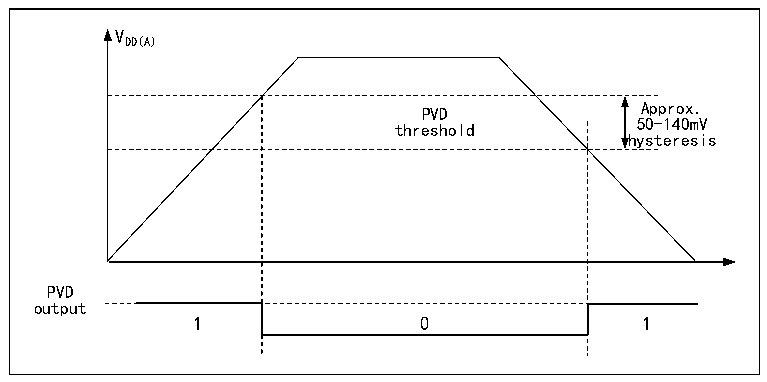

<!-- source-page: 10 -->

[← p.9](0009.md) · [index](../README.md) · [PDF p.10](https://ch32-riscv-ug.github.io/CH32V205/datasheet_en/CH32V205RM.PDF#page=10) · [p.11 →](0011.md)

<!-- header: CH32V205 Reference Manual https://wch-ic.com -->
2) Optional interrupt handling. the PVD function internally connects to the rising/falling edge trigger setting of  
line 8 of the EXTI module, turns on this interrupt (Configures EXTI), and generates a PVD interrupt when  
VDD drops below the PVD threshold or rises above the PVD threshold.  
3) Set the PVDE bit of PWR_CTLR register to enable the PVD function.  
4) Read the PVD0 bit of PWR_CSR status register to obtain the current system main power and PLS[2:0]  
setting threshold relationship, and perform the corresponding soft processing. When the VDD voltage is  
higher than the threshold set by PLS[2:0], PVD0 position 0; when the VDD voltage is lower than the threshold  
set by PLS[2:0], PVD0 position 1.  

Figure 2-3 Schematic diagram of PVD operation  
 <!-- rendered from the PDF; verify at https://ch32-riscv-ug.github.io/CH32V205/datasheet_en/CH32V205RM.PDF#page=10 -->

🖼 Text parsed from the figure above

VDD(A)  
PVD threshold  0  
hysteresis  
PVD  
output  

## 2.3 Low-power Modes

After a system reset, the microcontroller is in a normal operating state (Run mode), where system power can be  
saved by reducing the system main frequency or turning off the unused peripheral clock or reducing the operating  
peripheral clock. If the system does not need to work, you can set the system to enter low-power mode and let the  
system jump out of this state by specific events.  
Microcontrollers currently offer 3 low-power modes, divided in terms of operating differences between processors,  
peripherals, voltage regulators, etc.  
● Sleep mode: The core stops running and all peripherals (Including core private peripherals) are still running.  
● Stop mode: Stops all clocks; the system resumes operation upon wake-up. There are 4 sleep mode levels:  
Sleep Mode 1, Sleep Mode 2, Sleep Mode 3, and Sleep Mode 4. The corresponding configuration methods  
are shown in Table 2-1. For the current consumption of the four sleep mode levels, refer to the  
CH32V205DS0 Datasheet.  
● Standby mode: Stop all clocks; the microcontroller resets upon wake-up (power reset).  

<!-- p10-table-002 (table-2-1@1) pages 10-11 -->
<table><caption>Table 2-1 Low-power mode list</caption><tr><th>Mode</th><th>Enter</th><th>Wakeup source</th><th>Effect on clock</th><th>Voltage regulator</th></tr><tr><td rowspan="2">SLEEP</td><td>WFI</td><td>Any interrupt</td><td rowspan="2" style="text-align:left">Core clock OFF, no effect on other clocks</td><td rowspan="2">Normal</td></tr><tr><td>WFE</td><td>Wake-up event</td></tr><tr><td rowspan="4">STOP</td><td rowspan="4" style="text-align:left">Set SLEEPDEEP to 1 Clear PDDS to 1 WFI or WFE</td><td rowspan="4" style="text-align:left">Any external interrupt/event, external reset on the NRST pin, PVD output, IWDG reset, RTC alarm, USB wake-up signal, USB PD wake-up signal, CMP wake-up signal, etc.</td><td rowspan="4" style="text-align:left">Disable HSE, HSI, PLL and peripheral clocks</td><td style="text-align:left">Stop mode 1: LPDS=0, PDDS=0</td></tr><tr><td style="text-align:left">Sleep mode 2 (LDO power-saving Mode): LPDS=0, PDDS=0, AUTO_LDO_EC=1 or LPDS=0, PDDS=0, LDO_EC=1</td></tr><tr><td style="text-align:left">Sleep mode 3: RAMLV=0, PDDS=0, LPDS=1</td></tr><tr><td style="text-align:left">Sleep mode 4: RAMLV=1, PDDS=0, LPDS=1</td></tr><tr><td>STANDBY</td><td style="text-align:left">Set SLEEPDEEP to 1 Clear PDDS to 1 WFI or WFE</td><td style="text-align:left">Any of the external events EXTI0–EXTI17 (excluding interrupts), the rising edge of the WKUP pin, RTC alarm events, reset via the NRST pin, IWDG reset, etc.</td><td style="text-align:left">Disable HSE, HIS, PLL and peripheral clocks</td><td>Disable</td></tr></table>

<!-- image: p10-draw-image-00001 bbox=[506.88, 783.6, 525.96, 793.8] -->
<!-- footer: V1.2 8 -->
