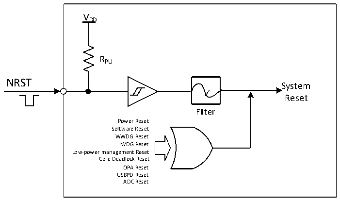

<!-- source-page: 18 -->

[← p.17](0017.md) · [index](../README.md) · [PDF p.18](https://ch32-riscv-ug.github.io/CH32V205/datasheet_en/CH32V205RM.PDF#page=18) · [p.19 →](0019.md)

<!-- header: CH32V205 Reference Manual https://wch-ic.com -->
PFIC_CFGR or the SYSRST bit 1 of the configuration register PFIC_SCTLR in the programmable interrupt  
controller PFIC. Refer to the corresponding chapter for details.  
Low power management reset: Standby mode reset will be enabled by setting the STANDBY_RST position 1 in  
the user option byte. This will perform a system reset instead of entering standby mode after the process of  
entering standby mode is executed. The stop mode reset is enabled by setting the STOP_RST bit in the  
user-selected byte to 0. When the procedure to enter stop mode is performed, a system reset is performed instead  
of entering stop mode.  
Core deadlock reset: When the EXTEN_CTLR0 register LKUPEN bit is enabled, the system will reset if a core  
run exception cannot be recovered and a deadlock occurs.  
OPA reset: When the OPA reset enable is turned on, the high level of the output of the operational amplifier will  
generate an OPA reset.  
USBPD reset: when PD_RST_EN is 1, CH32V205 supports the reset generated by USB PD signal frame Hard  
Reset; If IE_RX_RESET is also 1, it also supports the reset generated by the signal frame Cable Reset. USB PD  
has no reset flag, but it produces the same reset effect as software reset.  
ADC Reset: With ADC watchdog reset enable on, an ADC reset is generated when the ADC data is greater than  
the watchdog high threshold or less than the watchdog low threshold.  

Figure 3-1 System reset structure  
 <!-- rendered from the PDF; verify at https://ch32-riscv-ug.github.io/CH32V205/datasheet_en/CH32V205RM.PDF#page=18 -->

🖼 Text parsed from the figure above

VDD  
RPU  
NRST  
System  
Reset  
Filter  
Power Reset  
Software Reset  
WWDG Reset  
IWDG Reset  
Low-power management Reset  
Core Deadlock Reset  
OPA Reset  
USBPD Reset  
ADC Reset  

### 3.2.3 Backup Domain Reset

When a backup domain reset occurs, only the backup domain registers are reset, including the backup registers  
and the RCC_BDCTLR register (RTC enable and LSE oscillator). The conditions under which this occurs  
include:  
● Caused by power-up from VDD or VBAT after both VDD and VBAT have been powered down  
● BDRST bit set in the RCC_BDCTLR register  
● BKPRST bit set in the RCC_PB1PRSTR register  
<!-- image: p18-draw-image-00001 bbox=[511.32, 783.6, 530.4, 793.8] -->
<!-- footer: V1.2 16 -->
