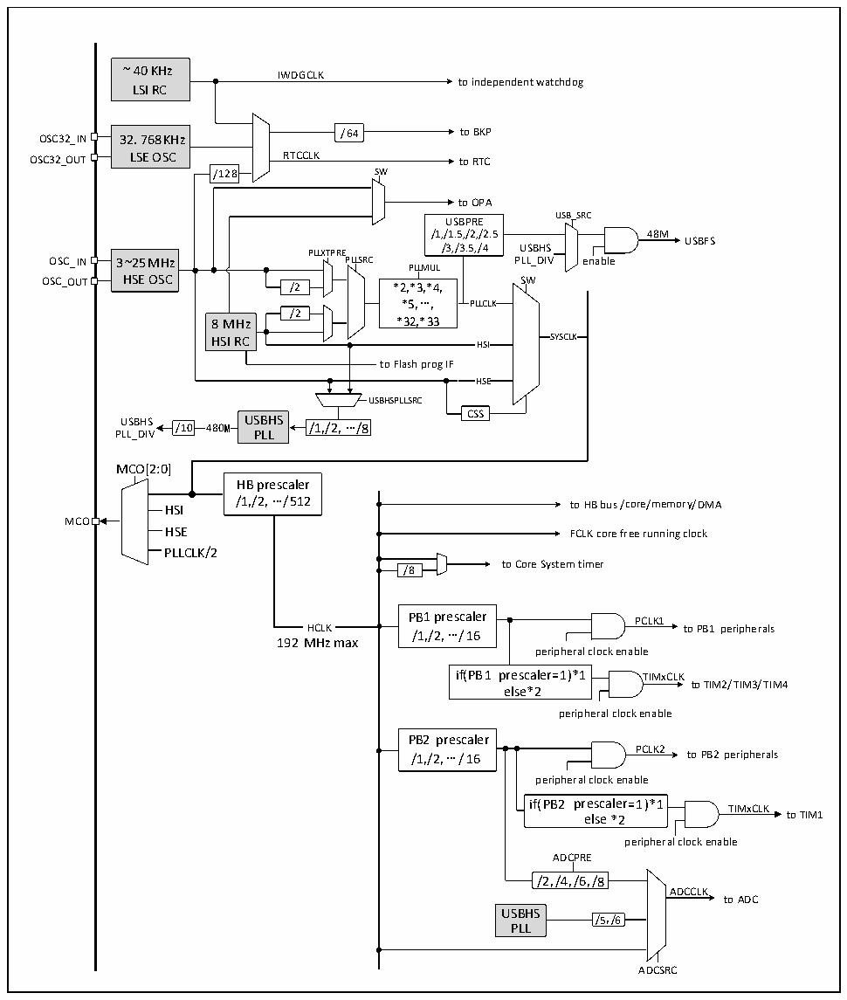

<!-- source-page: 19 -->

[← p.18](0018.md) · [index](../README.md) · [PDF p.19](https://ch32-riscv-ug.github.io/CH32V205/datasheet_en/CH32V205RM.PDF#page=19) · [p.20 →](0020.md)

<!-- header: CH32V205 Reference Manual https://wch-ic.com -->

## 3.3 Clock

### 3.3.1 System Clock Structure

Figure 3-2 Clock tree block diagram  
 <!-- rendered from the PDF; verify at https://ch32-riscv-ug.github.io/CH32V205/datasheet_en/CH32V205RM.PDF#page=19 -->

🖼 Text parsed from the figure above

~40 KHz IWDGCLK  
to independent watchdog  
LSI RC  
32.768 KHz LSE OSC  
OSC32_IN 32.768 KHz /64 to BKP  
OSC32_OUT LSE OSC RTCCLK to RTC  
/128  
/128 SW  
to OPA  
USB_SRC  
USBPRE  
/1,/1.5,/2,/2.5 48M  
USBFS  
PLLXTPRE /3,/3.5,/4 USBHS  
3~25 MHz HSE OSC  
OSC_IN 3~25 MHz PLLSRC PLL_DIV enable  
PLLMUL  
SW  
/2 *2,*3,*4,  
*5,..., PLLCLK  
/2  
8 MHz *32,*33  
HSI to Flash prog IFHSE  
USBHSPLLSRC  
CSS  
USBHS /10 480M USBHS /1,/2,.../8  
PLL_DIV PLL  
MCO[2:0]  
HB prescaler  
/1,/2,.../512  
to HB bus/core/memory/DMA  
HSI  
MCO  
HSE FCLK core free running clock  
PLLCLK/2  
to Core System timer  
/8  
PB1 prescaler PCLK1  
HCLK /1,/2,.../16 to PB1 peripherals  
192MHz max  
peripheral clock enable  
if(PB1 prescaler= 1)*1 TIMxCLK  
to TIM2/TIM3/TIM4  
else* 2  
peripheral clock enable  
PB2 prescaler  
/1,/2,.../16 PCLK2 to PB2 peripherals  
peripheral clock enable  
if(PB2 prescaler=1)*1 TIMxCLK  
<!-- image: p19-draw-image-00002 inside the figure -->
<!-- image: p19-draw-image-00003 inside the figure -->
e l s e * 2 to TIM1  
peripheral clock enable  
ADCPRE  
/2,/4,/6,/8  
ADCCLK  
to ADC  
USBHS /5,/6  
PLL  
ADCSRC  

<!-- image: p19-draw-image-00001 bbox=[511.32, 783.6, 530.4, 793.8] -->
<!-- footer: V1.2 17 -->
