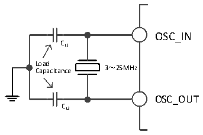

<!-- source-page: 20 -->

[← p.19](0019.md) · [index](../README.md) · [PDF p.20](https://ch32-riscv-ug.github.io/CH32V205/datasheet_en/CH32V205RM.PDF#page=20) · [p.21 →](0021.md)

<!-- header: CH32V205 Reference Manual https://wch-ic.com -->

### 3.3.2 High-speed Clock (HSI/HSE)

HSI is a high-speed clock signal generated by the system&#x27;s internal 24MHz RC oscillator. HSI RC oscillator can  
provide system clock without any external devices. It has a short start-up time. HSI is enabled and disabled by  
setting the HSION bit in the RCC_CTLR register, and the HSIRDY bit indicates whether the HSI RC oscillator is  
stable or not. The system defaults HSION and HSIRDY to 1 (It is recommended not to turn them off). If the  
HSIRDYIE bit in the RCC_INTR register is set, the corresponding interrupt will be generated.  
● The HSI RC oscillator can put HSI pin 1 into internal low-power mode via the RCC_CTRL register. Once  
the HSI enters low-power mode, the output frequency drops from 8 MHz to 1MHz.  
● Factory calibration: The difference of manufacturing process will cause different RC oscillation frequency  
for each chip, so HSI calibration is performed for each chip before it is shipped. After system reset, the  
factory calibration value is loaded into HSICAL[7:0] of the RCC_CTLR register.  
● User tuning: Based on different voltages or ambient temperatures, the application can adjust the HSI  
frequency by using the HSITRIM[4:0] bits in the RCC_CTLR register.  
<em>Note: If the HSE crystal oscillator fails, the HSI clock is used as a backup clock source (Clock safety system).</em>  
HSE is an external high-speed clock signal, including external crystal/ceramic resonator generation or external  
high speed clock feed.  
The HSE crystal oscillator can be set to low-power mode via bit 1 of the HSELP register in the RCC_CTRL  
register.  
● External crystal/ceramic resonator (HSE crystal): external oscillator provides a more accurate clock source  
for the system. For further information, please refer to the electrical characteristics section of the data manual.  
The HSE crystal can be turned on and off by setting the HSEON bit in the RCC_CTLR register, and the  
HSERDY bit indicates whether the HSE crystal oscillation is stable or not, and the hardware sends the clock  
into the system after HSERDY position 1. If the HSERDYIE bit of the RCC_INTR register is set, the  
corresponding interrupt will be generated.  

Figure 3-3 High-speed external crystal circuit  
 <!-- rendered from the PDF; verify at https://ch32-riscv-ug.github.io/CH32V205/datasheet_en/CH32V205RM.PDF#page=20 -->

🖼 Text parsed from the figure above

OSC_IN  
CL1  
L C o a a p d a citance 3～25MHz  
OSC_OUT  
CL2  

<em>Note: The load capacitance should be as close to the oscillator pin as possible, and the capacity value should be</em>  
<em>selected according to the parameters of the crystal manufacturer.</em>  
● External high-speed clock source (HSE bypass): In this mode, an external clock source is fed directly to the  
OSC_IN pin, and the OSC_OUT pin is left floating. The maximum supported frequency is 25MHz. To  
enable the HSE bypass function, the application must first set the HSEBYP bit while the HSEON bit is set to  
0, and then set the HSEON bit.  
<!-- image: p20-draw-image-00001 bbox=[511.32, 783.6, 530.4, 793.8] -->
<!-- footer: V1.2 18 -->
