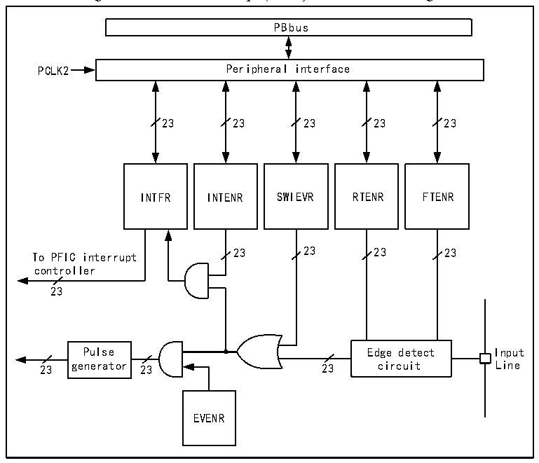

<!-- source-page: 66 -->

[← p.65](0065.md) · [index](../README.md) · [PDF p.66](https://ch32-riscv-ug.github.io/CH32V205/datasheet_en/CH32V205RM.PDF#page=66) · [p.67 →](0067.md)

<!-- header: CH32V205 Reference Manual https://wch-ic.com -->

## 9.4 External Interrupt and Event Controller (EXTI)

### 9.4.1 Overview

Figure 9-1 External interrupt (EXTI) interface block diagram  
 <!-- rendered from the PDF; verify at https://ch32-riscv-ug.github.io/CH32V205/datasheet_en/CH32V205RM.PDF#page=66 -->

🖼 Text parsed from the figure above

PBbus  
PCLK2 Peripheral interface  
23 23 23 23 23  
INTFR INTENR SWIEVR RTENR FTENR  
23 23 23 23  
To PFIC interrupt  
controller  
23  
Pulse Edge detect Input  
23 generator 23 23 circuit Line  
EVENR  

As can be seen from figure 9-1, the trigger source of the external interrupt can be either a software interrupt  
(SWIEVR) or an actual external interrupt channel, and the signal of the external interrupt channel is first screened  
by the edge detection circuit. As long as one of the software interrupts or external interrupt signals is generated, it  
will be output to both event enabling and interrupt enabling circuits through the OR gate circuit in the diagram. As  
long as an interrupt is enabled or an event is enabled, an interrupt or event will occur. The six registers of EXTI  
are accessed by the processor through the PB2 interface.  

### 9.4.2 Wakeup Event

The system can wake up sleep patterns caused by WFE instructions through wake-up events. Wake-up events are  
generated through the following two configurations:  
● Enable an interrupt in the register of the peripheral, but not in the PFIC of the core, as well as the  
SEVONPEND bit in the core. Reflected in EXTI, it enables EXTI interrupts, but does not enable EXTI  
interrupts in PFIC, while enabling SEVONPEND bits. When CPU wakes up from WFE, the interrupt flag bit  
and PFIC hang bit of EXTI need to be cleared.  
● Enable an EXTI channel to be an event channel, and after CPU wakes up from WFE, there is no need to clear  
the operation of the interrupt flag bit and PFIC hang bit.  

### 9.4.3 Description

The use of external interrupt needs to configure the corresponding external interrupt channel, that is, select the  
<!-- image: p66-draw-image-00001 bbox=[511.32, 783.6, 530.4, 793.8] -->
<!-- footer: V1.2 64 -->
