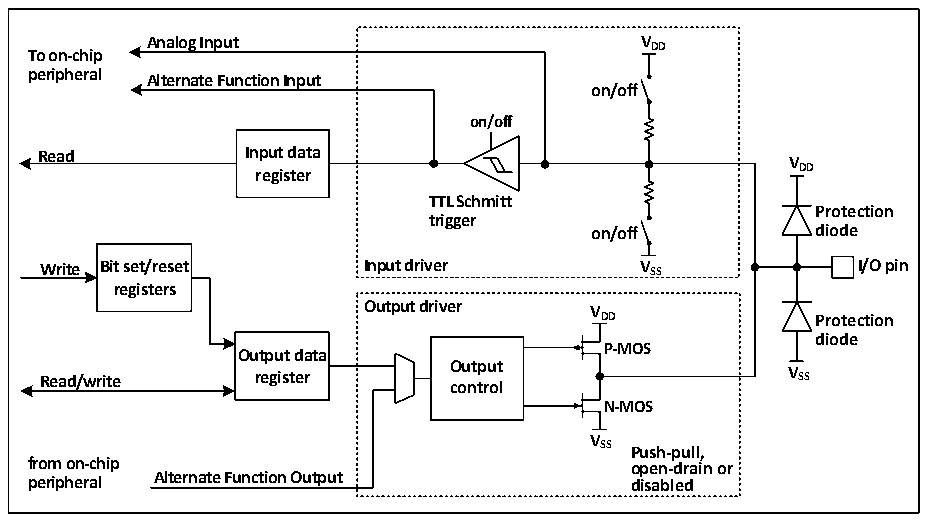

<!-- source-page: 92 -->

[← p.91](0091.md) · [index](../README.md) · [PDF p.92](https://ch32-riscv-ug.github.io/CH32V205/datasheet_en/CH32V205RM.PDF#page=92) · [p.93 →](0093.md)

<!-- header: CH32V205 Reference Manual https://wch-ic.com -->

## 10.2 Function Description

### 10.2.1 Overview

Figure 10-1 GPIO module basic structure block diagram  
 <!-- rendered from the PDF; verify at https://ch32-riscv-ug.github.io/CH32V205/datasheet_en/CH32V205RM.PDF#page=92 -->

🖼 Text parsed from the figure above

<strong>Analog Input V DD</strong>  
<strong>To on-chip</strong>  
<strong>peripheral Alternate Function Input</strong>  
<strong>on/off</strong>  
<strong>on/off</strong>  
<strong>Read Input data</strong>  
<strong>V</strong>  
<strong>register DD</strong>  
<strong>TTL Schmitt</strong>  
<strong>Protection</strong>  
<strong>trigger</strong>  
<strong>on/off diode</strong>  
<strong>Write Bit set/reset Input driver V SS I/O pin</strong>  
<strong>registers</strong>  
<strong>Output driver V</strong>  
<strong>DD Protection</strong>  
<strong>diode</strong>  
<strong>P-MOS</strong>  
<strong>Output data</strong>  
<strong>Read/write register O co u n t t p r u o t l V SS</strong>  
<strong>N-MOS</strong>  
<strong>V</strong>  
<strong>SS Push-pull,</strong>  
<strong>from on-chip open-drain or</strong>  
<strong>peripheral Alternate Function Output disabled</strong>  

As shown in figure 10-1, the IO port structure, each pin has two protection diodes inside the chip, and the IO port  
can be divided into input and output drive modules. The input driver has a weak pull-up resistor, which can be  
connected to AD and other analog input peripherals; if you input to a digital peripheral, you need to go through a  
TTL Schmitt trigger, and then connect to the GPIO input register or other multiplexed peripherals. The output  
driver has a pair of MOS tubes, and the IO port can be configured to open-drain or push-pull output by  
configuring whether the upper and lower MOS tubes are enabled or not; the output driver can also be configured  
to be controlled by GPIO or by other peripherals that are reused.  

### 10.2.2 GPIO Initialization Function

Just after the reset, the GPIO port is running in the initial state, at this time, most IO ports are running in the  
floating input state, but there are also HSE and other peripheral-related pins that run on the peripheral reuse  
function. For specific initialization functions, please refer to the relevant sections of the pin description.  

### 10.2.3 External Interrupts

All GPIO ports can be configured with external interrupt input channels, but an external interrupt input channel  
can only be mapped to one GPIO pin, and the sequence number of the external interrupt channel must be  
consistent with the tag of the GPIO port, such as PA1 (Or PB1, PC1, PD1, PE1) can only be mapped to EXTI1,  
and EXTI1 can only accept the mapping of one of PA1, PB1, PC1, PD1 or PE1, etc., both sides are one-to-one  
relationship.  

### 10.2.4 Alternate Function Multiplexer and Mapping

<strong>Alternate function</strong>  
I/O pins are connected to on-board peripherals/modules via a multiplexer, which allows only one peripheral’s  
<!-- image: p92-draw-image-00001 bbox=[511.32, 783.6, 530.4, 793.8] -->
<!-- footer: V1.2 68 -->
