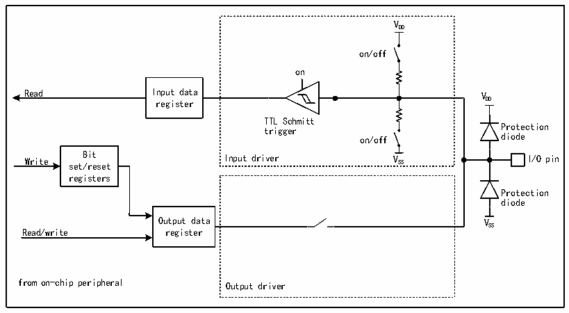

<!-- source-page: 93 -->

[← p.92](0092.md) · [index](../README.md) · [PDF p.93](https://ch32-riscv-ug.github.io/CH32V205/datasheet_en/CH32V205RM.PDF#page=93) · [p.94 →](0094.md)

<!-- header: CH32V205 Reference Manual https://wch-ic.com -->
alternate function (AF) to be connected to an I/O pin at a time. This ensures that no conflicts occur between  
peripherals sharing the same I/O pin.  
Each I/O pin has a multiplexer that accepts up to 8-channel alternate function inputs (AF0 through AF7), which  
can be configured via the GPIOx_AFLR and GPIOx_AFHR registers:  
After reset, the multiplexer is set to alternate function 0 (AF0). In alternate mode, I/O is configured via the  
GPIOx_CFGLR/GPIOx_CFGHR registers.  
The specific alternate function assignments for each pin are detailed in the CH32V205DS0.  
<strong>Alternate function configuration</strong>  
● To use the alternate function in the input direction, the port must be configured in multiplexed input mode;  
the pull-up or pull-down settings can be configured as needed.  
● To use the alternate function in the output direction, the port must be configured in multiplexed output mode;  
the push-pull or open-drain settings can be configured as needed.  
● For bidirectional alternate function, the port must be configured in multiplexed output mode; in this case, the  
driver is configured in floating input mode.  
There may be multiple peripherals multiplexed to this pin in the same IO port, so in order to maximize the space  
for each peripheral, in addition to the default multiplexed pin, the multiplexed pin of the peripheral can be  
remapped to other pins to avoid the occupied pin.  

### 10.2.5 Locking Mechanism

The locking mechanism can lock the configuration of the IO port. After a specific write sequence, the selected IO  
pin configuration is locked and cannot be changed until the next reset.  

### 10.2.6 Input Configuration

Figure 10-2 GPIO module input configuration structure block diagram  
 <!-- rendered from the PDF; verify at https://ch32-riscv-ug.github.io/CH32V205/datasheet_en/CH32V205RM.PDF#page=93 -->

🖼 Text parsed from the figure above

V  
DD  
on/off  
on  
Read Input data V  
register DD  
TTL Schmitt  
trigger Protection  
on/off diode  
Write set B /r it es et Input driver V SS I/O pin  
registers  
Protection  
diode  
Output data V  
SS  
Read/write register  
from on-chip peripheral Output driver  

When the IO port is configured in input mode, the output driver is disconnected, the input up and down is optional,  
and the alternate function and analog input are not connected. The data on each IO port is sampled to the input  
data register at each PB2 clock, and the level state of the corresponding pin is obtained by reading the  
<!-- image: p93-draw-image-00001 bbox=[511.32, 783.6, 530.4, 793.8] -->
<!-- footer: V1.2 69 -->
