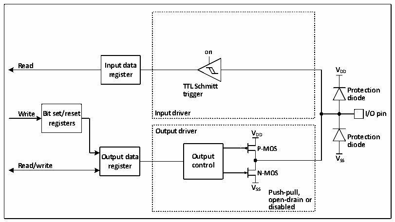
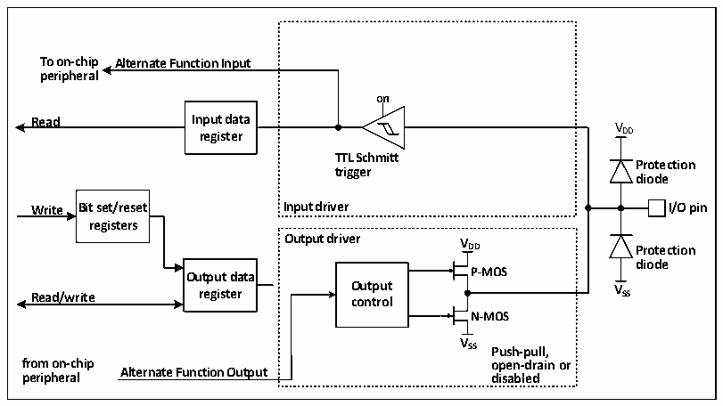

<!-- source-page: 94 -->

[← p.93](0093.md) · [index](../README.md) · [PDF p.94](https://ch32-riscv-ug.github.io/CH32V205/datasheet_en/CH32V205RM.PDF#page=94) · [p.95 →](0095.md)

<!-- header: CH32V205 Reference Manual https://wch-ic.com -->
corresponding bit of the input data register.  

### 10.2.7 Output Configuration

Figure 10-3 GPIO module output configuration structure block diagram  
 <!-- rendered from the PDF; verify at https://ch32-riscv-ug.github.io/CH32V205/datasheet_en/CH32V205RM.PDF#page=94 -->

🖼 Text parsed from the figure above

<strong>on</strong>  
<strong>Read Input data</strong>  
<strong>V</strong>  
<strong>register DD</strong>  
<strong>TTL Schmitt</strong>  
<strong>Protection</strong>  
<strong>trigger</strong>  
<strong>diode</strong>  
<strong>Write Bit set/reset Input driver I/O pin</strong>  
<strong>registers</strong>  
<strong>Output driver V</strong>  
<strong>DD Protection</strong>  
<strong>diode</strong>  
<strong>P-MOS</strong>  
<strong>Output data Output VSS</strong>  
<strong>Read/write register control</strong>  
<strong>N-MOS</strong>  
<strong>V</strong>  
<strong>SS Push-pull,</strong>  
<strong>open-drain or</strong>  
<strong>disabled</strong>  

When the IO port is configured in output mode, a pair of MOS in the output driver can be configured in push-pull  
or open-drain mode as needed, without using the alternate function. The input-driven pull-up resistor is disabled,  
the TTL Schmitt trigger is activated, and the level that appears on the IO pin will be sampled to the input data  
register at each PB2 clock, so reading the input data register will get the IO state, and in push-pull output mode,  
access to the output data register will get the last written value.  

### 10.2.8 Alternate Function Configuration

Figure 10-4 The structure of GPIO module when it is multiplexed by other peripherals  
 <!-- rendered from the PDF; verify at https://ch32-riscv-ug.github.io/CH32V205/datasheet_en/CH32V205RM.PDF#page=94 -->

🖼 Text parsed from the figure above

<strong>To on-chip Alternate Function Input</strong>  
<strong>peripheral</strong>  
<strong>on</strong>  
<strong>Read Input data V</strong>  
<strong>register DD</strong>  
<strong>TTL Schmitt</strong>  
<strong>Protection</strong>  
<strong>trigger</strong>  
<strong>diode</strong>  
<strong>Write Bit set/reset Input driver I/O pin</strong>  
<strong>registers</strong>  
<strong>Output driver V</strong>  
<strong>DD Protection</strong>  
<strong>diode</strong>  
<strong>Output data P-MOS</strong>  
<strong>Read/write register O co u n t t p r u o t l V SS</strong>  
<strong>N-MOS</strong>  
<strong>V</strong>  
<strong>SS Push-pull,</strong>  
<strong>from on-chip open-drain or</strong>  
<strong>Alternate Function Output</strong>  
<strong>peripheral disabled</strong>  

When the alternate function is enabled, the output driver is enabled and can be configured in open-drain or  
push-pull mode as needed, the Schmitt trigger is also turned on, the input and output lines of the alternate function  
are connected, but the output data register is disconnected, and the level that appears on the IO pin will be  
<!-- image: p94-draw-image-00001 bbox=[511.32, 783.6, 530.4, 793.8] -->
<!-- footer: V1.2 70 -->
