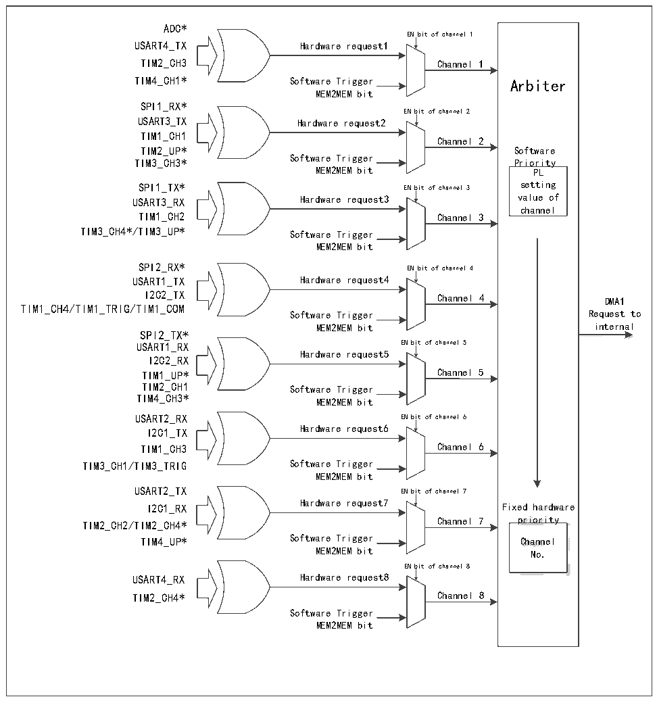

<!-- source-page: 114 -->

[← p.113](0113.md) · [index](../README.md) · [PDF p.114](https://ch32-riscv-ug.github.io/CH32V205/datasheet_en/CH32V205RM.PDF#page=114) · [p.115 →](0115.md)

<!-- header: CH32V205 Reference Manual https://wch-ic.com -->

Figure 11-1 DMA1 request mapping  
 <!-- rendered from the PDF; verify at https://ch32-riscv-ug.github.io/CH32V205/datasheet_en/CH32V205RM.PDF#page=114 -->

🖼 Text parsed from the figure above

ADC*  
EN bit of channel 1  
USART4_TX Hardware request1  
TIM2_CH3 Channel 1  
TIM4_CH1* Software Trigger Arbiter  
MEM2MEM bit  
SPI1_RX*  
EN bit of channel 2  
USART3_TX Hardware request2  
TIM1_CH1  
Channel 2  
TIM2_UP* Software  
Software Trigger  
TIM3_CH3* Priority  
MEM2MEM bit PL  
SPI1_TX* EN bit of channel 3 setting  
USART3_RX Hardware request3 value of  
channel  
TIM1_CH2 Channel 3  
TIM3_CH4*/TIM3_UP* Software Trigger  
MEM2MEM bit  
SPI2_RX* EN bit of channel 4  
USART1_TX Hardware request4  
I2C2_TX Channel 4 DMA1  
<!-- image: p114-draw-image-00003 inside the figure -->
TIM1_CH4/TIM1_TRIG/TIM1_COM  
Software Trigger Request to  
MEM2MEM bit internal  
SPI2_TX*  
USART1_RX EN bit of channel 5  
Hardware request5  
I2C2_RX  
TIM1_UP* Channel 5  
TIM2_CH1 Software Trigger  
TIM4_CH3*  
MEM2MEM bit  
USART2_RX EN bit of channel 6  
I2C1_TX Hardware request6  
TIM1_CH3 Channel 6  
TIM3_CH1/TIM3_TRIG Software Trigger  
MEM2MEM bit  
USART2_TX EN bit of channel 7  
I2C1_RX Hardware request7 Fixed hardware  
<!-- image: p114-draw-image-00002 inside the figure -->
TIM2_CH2/TIM2_CH4* Channel 7 priority  
TIM4_UP* Software Trigger Channel  
MEM2MEM bit No.  
EN bit of channel 8  
USART4_RX Hardware request8  
TIM2_CH4* Channel 8  
Software Trigger  
MEM2MEM bit  

<!-- image: p114-draw-image-00001 bbox=[511.32, 783.6, 530.4, 793.8] -->
<!-- footer: V1.2 90 -->
