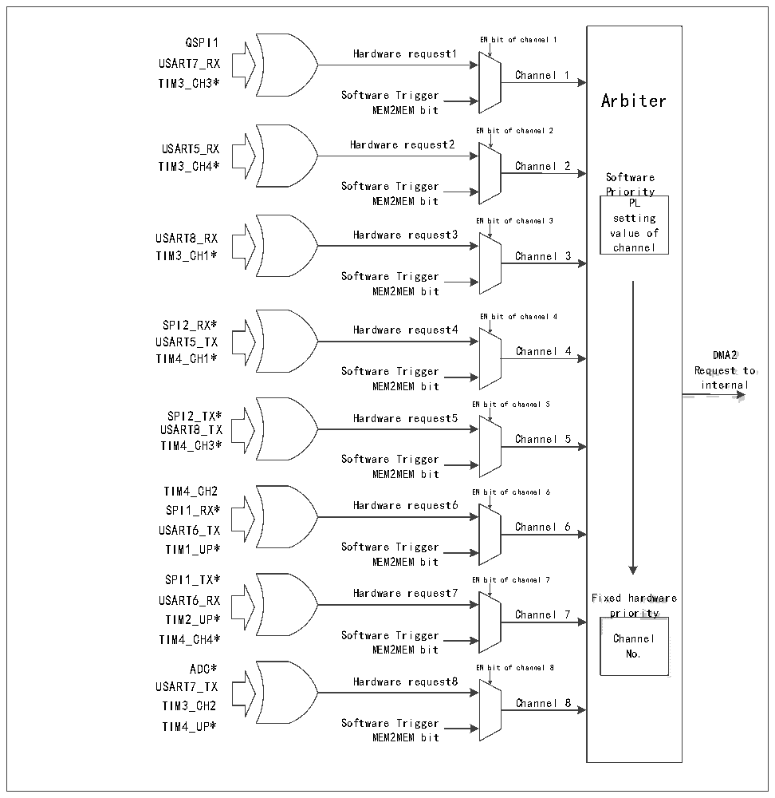

<!-- source-page: 115 -->

[← p.114](0114.md) · [index](../README.md) · [PDF p.115](https://ch32-riscv-ug.github.io/CH32V205/datasheet_en/CH32V205RM.PDF#page=115) · [p.116 →](0116.md)

<!-- header: CH32V205 Reference Manual https://wch-ic.com -->

Figure 11-2 DMA2 request mapping  
 <!-- rendered from the PDF; verify at https://ch32-riscv-ug.github.io/CH32V205/datasheet_en/CH32V205RM.PDF#page=115 -->

🖼 Text parsed from the figure above

QSPI1 EN bit of channel 1  
Hardware request1  
USART7_RX  
Channel 1  
TIM3_CH3*  
Software Trigger Arbiter  
MEM2MEM bit  
EN bit of channel 2  
USART5_RX Hardware request2  
TIM3_CH4* Channel 2  
Software  
Software Trigger  
Priority  
MEM2MEM bit PL  
setting  
EN bit of channel 3  
USART8_RX Hardware request3 value of  
channel  
TIM3_CH1* Channel 3  
Software Trigger  
MEM2MEM bit  
EN bit of channel 4  
SPI2_RX*  
Hardware request4  
USART5_TX  
TIM4_CH1* Channel 4 DMA2  
<!-- image: p115-draw-image-00003 inside the figure -->
Software Trigger Request to  
MEM2MEM bit internal  
EN bit of channel 5  
SPI2_TX* Hardware request5  
USART8_TX  
Channel 5  
TIM4_CH3*  
Software Trigger  
MEM2MEM bit  
TIM4_CH2 EN bit of channel 6  
SPI1_RX* Hardware request6  
USART6_TX Channel 6  
TIM1_UP* Software Trigger  
MEM2MEM bit  
SPI1_TX* EN bit of channel 7  
USART6_RX Hardware request7 Fixed hardware  
<!-- image: p115-draw-image-00002 inside the figure -->
TIM2_UP* Channel 7 priority  
TIM4_CH4* Software Trigger Channel  
MEM2MEM bit No.  
ADC* EN bit of channel 8  
USART7_TX Hardware request8  
TIM3_CH2 Channel 8  
TIM4_UP* Software Trigger  
MEM2MEM bit  

<!-- p115-table-001 (table-11-2@1) pages 115-116 -->
<table><caption>Table 11-2 DMA1 channel peripheral mapping table</caption><tr><th>Peripheral</th><th>Channel 1</th><th>Channel 2</th><th>Channel 3</th><th>Channel 4</th><th>Channel 5</th><th>Channel 6</th><th>Channel 7</th><th>Channel 8</th></tr><tr><td>ADC</td><td>ADC*</td><td></td><td></td><td></td><td></td><td></td><td></td><td></td></tr><tr><td>SPI1</td><td></td><td>SPI1_RX*</td><td>SPI1_TX*</td><td></td><td></td><td></td><td></td><td></td></tr><tr><td>SPI2</td><td></td><td></td><td></td><td>SPI2_RX*</td><td>SPI2_TX*</td><td></td><td></td><td></td></tr><tr><td>USART1</td><td></td><td></td><td></td><td style="text-align:left">USART1_TX</td><td style="text-align:left">USART1_RX</td><td></td><td></td><td></td></tr><tr><td>USART2</td><td></td><td></td><td></td><td></td><td></td><td style="text-align:left">USART2_RX</td><td style="text-align:left">USART2_TX</td><td></td></tr><tr><td>USART3</td><td></td><td style="text-align:left">USART3_TX</td><td style="text-align:left">USART3_RX</td><td></td><td></td><td></td><td></td><td></td></tr><tr><td>USART4</td><td style="text-align:left">USART4_TX</td><td></td><td></td><td></td><td></td><td></td><td></td><td style="text-align:left">USART4_RX</td></tr><tr><td>I2C1</td><td></td><td></td><td></td><td></td><td></td><td>I2C1_TX</td><td>I2C1_RX</td><td></td></tr><tr><td>I2C2</td><td></td><td></td><td></td><td>I2C2_TX</td><td>I2C2_RX</td><td></td><td></td><td></td></tr><tr><td>TIM1</td><td></td><td>TIM1_CH1</td><td>TIM1_CH2</td><td style="text-align:left">TIM1_CH4TIM1_TRIGTIM1_COM</td><td>TIM1_UP*</td><td>TIM1_CH3</td><td></td><td></td></tr><tr><td>TIM2</td><td>TIM2_CH3</td><td>TIM2_UP*</td><td></td><td></td><td>TIM2_CH1</td><td></td><td style="text-align:left">TIM2_CH2TIM2_CH4 *</td><td style="text-align:left">TIM2_CH4 *</td></tr><tr><td>TIM3</td><td></td><td style="text-align:left">TIM3_CH3 *</td><td style="text-align:left">TIM3_CH4 * TIM3_UP</td><td></td><td></td><td style="text-align:left">TIM3_CH1 * TIM3_TRIG</td><td></td><td></td></tr><tr><td>TIM4</td><td style="text-align:left">TIM4_CH1 *</td><td></td><td></td><td></td><td style="text-align:left">TIM4_CH3 *</td><td></td><td>TIM4_UP*</td><td></td></tr></table>

<!-- image: p115-draw-image-00001 bbox=[511.32, 783.6, 530.4, 793.8] -->
<!-- footer: V1.2 91 -->
