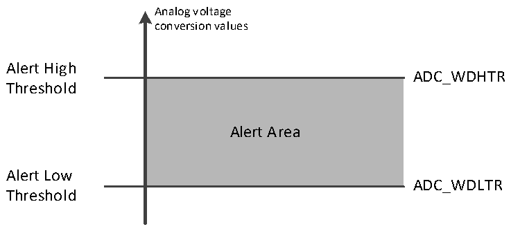

<!-- source-page: 133 -->

[← p.132](0132.md) · [index](../README.md) · [PDF p.133](https://ch32-riscv-ug.github.io/CH32V205/datasheet_en/CH32V205RM.PDF#page=133) · [p.134 →](0134.md)

<!-- header: CH32V205 Reference Manual https://wch-ic.com -->

Figure 12-4 Analog watchdog threshold area  
 <!-- rendered from the PDF; verify at https://ch32-riscv-ug.github.io/CH32V205/datasheet_en/CH32V205RM.PDF#page=133 -->

🖼 Text parsed from the figure above

Analog voltage  
conversion values  
Alert High  
ADC_WDHTR  
<!-- image: p133-draw-image-00002 inside the figure -->
Threshold  
Alert Area  
Alert Low  
ADC_WDLTR  
Threshold  

Configure the AWDSGL, AWDEN, JAWDEN, and AWDCH[4:0] bits of the ADC_CTLR1 register to select the  
channel for analog watchdog alert, see the following table for the relationship:  

<!-- p133-table-001 (table-12-4@1) -->
<table><caption>Table 12-4 Analog Watchdog channel selection</caption><tr><th rowspan="2" style="text-align:left">Analog Watchdog alert channel</th><th colspan="4">ADC_CTLR1 register control bit</th></tr><tr><td>AWDSGL</td><td>AWDEN</td><td>JAWDEN</td><td>AWDCH[4:0]</td></tr><tr><td>No alert</td><td>Ignore</td><td>0</td><td>0</td><td>Ignore</td></tr><tr><td>All injection channels</td><td>0</td><td>0</td><td>1</td><td>Ignore</td></tr><tr><td>All rule channels</td><td>0</td><td>1</td><td>0</td><td>Ignore</td></tr><tr><td style="text-align:left">All injection and rule channels</td><td>0</td><td>1</td><td>1</td><td>Ignore</td></tr><tr><td>Single injected channel</td><td>1</td><td>0</td><td>1</td><td style="text-align:left">Determine channel No.</td></tr><tr><td>Single regular channel</td><td>1</td><td>1</td><td>0</td><td style="text-align:left">Determine channel No.</td></tr><tr><td style="text-align:left">Single injected and regular channel</td><td>1</td><td>1</td><td>1</td><td style="text-align:left">Determine channel No.</td></tr></table>

### 12.2.6 Temperature Sensor

Chip built-in temperature sensor, connected to the ADC_INT16 channel, through ADC to convert the output  
voltage of the sensor into digital value to feedback the internal temperature of the chip, it is recommended to set  
the sampling time is 17.1μs. The output voltage of the temperature sensor varies linearly with the temperature.  
Due to the manufacturing discreteness, the slope and offset of the linear curve are different, so the internal  
temperature sensor is more suitable for detecting the change of temperature rather than measuring the absolute  
temperature. If you need to measure the temperature accurately, you should use an external temperature sensor.  
By setting the TSVREFE position 1 of the ADC_CTLR2 register, awakening the ADC internal sampling channel,  
software startup or external trigger starts the temperature sensor channel conversion of the ADC, and reads the  
data result (mV). Among them, the conversion formula of numerical value and temperature (℃) is as follows:  
Temperature (℃) = ((VSENSE-V25)/Avg_Slope)+25  
V25: The voltage value of the temperature sensor at 25°C  
Avg_Slope: Average slope of temperature and VSENSE curve (mV/℃)  
Refer to the actual values of V25 and Avg_Slope in the electrical characteristics section of the datasheet.  
<!-- image: p133-draw-image-00001 bbox=[515.88, 783.6, 534.96, 793.8] -->
<!-- footer: V1.2 109 -->
