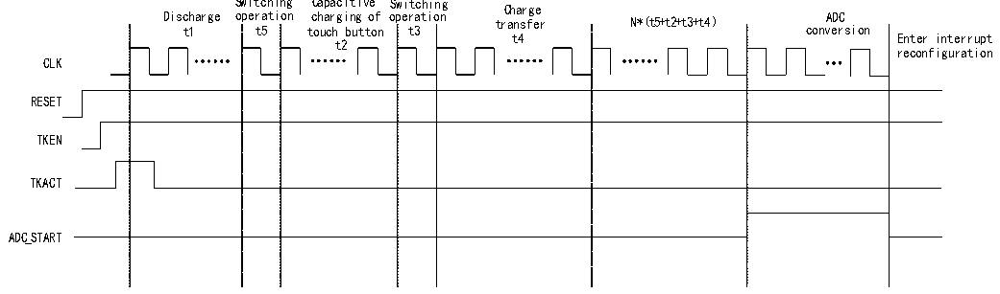

<!-- source-page: 146 -->

[← p.145](0145.md) · [index](../README.md) · [PDF p.146](https://ch32-riscv-ug.github.io/CH32V205/datasheet_en/CH32V205RM.PDF#page=146) · [p.147 →](0147.md)

<!-- header: CH32V205 Reference Manual https://wch-ic.com -->

# Chapter 13 Touch Key Detection (TKEY)

The touch detection control (TKEY) unit, with the help of the voltage conversion function of the ADC module,  
realizes the touch key detection function by converting the capacitance to the voltage for sampling. The detection  
channel reuses 16 external channels of the ADC, and the touch key detection is realized through the single  
conversion mode of the ADC module.  

## 13.1 TKEY Operations Steps

Note: For channels ADCIN0 through ADCIN15, one port is connected to CX (external reference capacitor), and  
the other port is connected to CS (touch button capacitor).  

### 13.1.1 TKEY Single Channel Charge Transfer Mode

Figure 13-1 TKEY single channel charge transfer mode timing diagram  
 <!-- rendered from the PDF; verify at https://ch32-riscv-ug.github.io/CH32V205/datasheet_en/CH32V205RM.PDF#page=146 -->

🖼 Text parsed from the figure above

Switching Capacitive Switching Charge  
arge oper  
a  
tion  
ope  
r  
ation transfer N*（t5+t2+t3+t4）  
Disc  
h  
c  
h  
a  
r  
g i  
n  
g  
o  
f  
A  
D  
C  
conv  
e  
r  
s ion  
t  
3  
t  
5  
t  
1  
t  
o  
u  
c  
h  
b  
u  
t t  
o  
n  
t4 Enter interrupt  
t2  
reconfiguration  
CLK  
RESET  
TKEN  
TKACT  
ADC_START  

Operation process:  
- (1) Configure the CX channel (one channel) using the SELCX field in the R32_CAP_CFG register, and configure
the CS channel (select one channel) using the SELCS field.  
- (2) Enable the drive mask function via the DRVEN field in the R32_DRV_CFG register (DRVEN=1), and
configure the channels to be masked via the DRVOUTSEL field (DRVOUTSEL[15:0]=0xFFFF).  
- (3) Configure the channel source selection bit using the CHSEL field in the R32_TKEY_CTRL register
(CHSEL=1), and configure the charge transfer mode using the MODE field (MODE=0).  
- (4) Configure the switch transition times (t5 and t3) using the TKSW field in the R32_TRANS_CFG register;
configure the number of charge transfers (N) using the TRANSN field; and configure the touch button capacitance  
charging time (t2) and charge transfer time (t4) using the TRANSCC field.  
- (5) Enable external trigger conversion for the regular channel via the EXTTRIG field (EXTTRIG=1) in the
ADC_CTLR2 register, and configure the external trigger event for the regular channel via the EXTSEL field  
(EXTSEL=110). the REGUSEL field configures the trigger source (REGUSEL=1), and the ADON field  
(ADON=1) enables the ADC (using the standard channel as an example; for the injection channel, the  
configuration is: JEXTTRIG=1, JEXTSEL=110, INJESEL=1).  
- (6) Enable TKEY by setting the TKEN field (TKEN=1) in the R32_TKEY_CTRL register; the TKACT field
(TKACT=1) serves as the control bit to trigger TKEY to begin operation.  
- (7) Wait for the EOC (End of Conversion) flag in the ADC status register to be set to 1, then read the ADC data
<!-- image: p146-draw-image-00001 bbox=[515.88, 783.6, 534.96, 793.8] -->
<!-- footer: V1.2 122 -->
