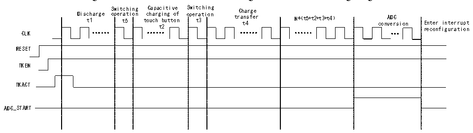
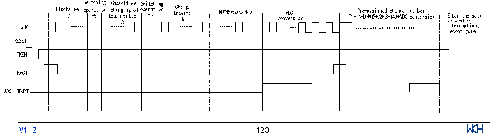

<!-- source-page: 147 -->

[← p.146](0146.md) · [index](../README.md) · [PDF p.147](https://ch32-riscv-ug.github.io/CH32V205/datasheet_en/CH32V205RM.PDF#page=147) · [p.148 →](0148.md)

<!-- header: CH32V205 Reference Manual https://wch-ic.com -->
register to obtain the conversion value. If the ADC interrupt is enabled, the system will enter the ADC interrupt to  
retrieve the conversion result.  

### 13.1.2 TKEY Multi-channel Charge Transfer Mode

Figure 13-2 TKEY multi-channel charge transfer mode timing diagram  
 <!-- rendered from the PDF; verify at https://ch32-riscv-ug.github.io/CH32V205/datasheet_en/CH32V205RM.PDF#page=147 -->

🖼 Text parsed from the figure above

Disc t h 1 arge S o w p i e t r t c a 5 h t i i n o g n t c o C h u a a c p r h a g t c 2 i b i n u t g t i t v o o e f n o S p w e i r t t a 3 c t h i i o n n g tr C a h t n a 4 s r f g e e r N*（t5+t2+t3+t4） conv A e D r C sion r E e nt co e n r f i i g nt ur e a r t r i u o pt n  
CLK  
RESET  
TKEN  
TKACT  
ADC_START  

Operation process:  
- (1) Configure the CX channel (a single channel) using the SELCX field in the R32_CAP_CFG register, and
configure the CS channel (multiple channels) using the SELCS field.  
- (2) Enable the drive mask function via the DRVEN field in the R32_DRV_CFG register (DRVEN=1), and
configure the channels to be masked via the DRVOUTSEL field (DRVOUTSEL[15:0]=0xFFFF).  
- (3) Configure the channel selection bit using the CHSEL field in the R32_TKEY_CTRL register (CHSEL=1), and
configure the charge transfer mode using the MODE field (MODE=0).  
- (4) Configure the switching times (t5 and t3) using the TKSW field in the R32_TRANS_CFG register; configure
the number of charge transfers (N) using the TRANSN field; and configure the touch button capacitance charging  
time (t2) and charge transfer time (t4) using the TRANSCC field.  
- (5) Enable external trigger conversion for the regular channel via the EXTTRIG field (EXTTRIG=1) in the
ADC_CTLR2 register, and configure the external trigger event for the regular channel via the EXTSEL field  
(EXTSEL=110). the REGUSEL field configures the trigger source (REGUSEL=1), and the ADON field  
(ADON=1) enables the ADC (using the standard channel as an example; for the injection channel, the  
configuration is: JEXTTRIG=1, JEXTSEL=110, INJESEL=1).  
- (6) Enable TKEY by setting the TKEN field (TKEN=1) in the R32_TKEY_CTRL register; the TKACT field
(TKACT=1) serves as the control bit to trigger TKEY to begin operation.  
- (7) Wait for the EOC (End of Conversion) flag in the ADC status register to be set to 1, then read the ADC data
register to obtain the conversion value. If the ADC interrupt is enabled, the system will enter the interrupt routine  
to retrieve the conversion result.  

### 13.1.3 TKEY Charge Transfer Auto-scan Mode

Figure 13-3 TKEY charge transfer auto-scan mode timing diagram  
 <!-- rendered from the PDF; verify at https://ch32-riscv-ug.github.io/CH32V205/datasheet_en/CH32V205RM.PDF#page=147 -->

🖼 Text parsed from the figure above

Switching Capacitive Switching  
Disch t a 1 rge oper t a 5 tion t c o h u a c r h t g 2 i b n u g t t o o f n ope t r 3 ation t C r h a a n t r 4 s g f e e r N*（t5+t2+t3+t4） conv A e D r C s ion （T1+（ P N r +1 e ） - * a （ s t s 5 i + g t n 2+ e t d 3 + c t4 h ） a + n A ne DC l c n o u n m v b e e r r sion E c n o t m e p r l e t t h i e o n s can  
CLK interruption,  
reconfigure  
RESET  
T KEN  
TKACT  
ADC_START  
<!-- image: p147-draw-image-00001 inside the figure -->
<!-- footer: V1.2 123 -->

