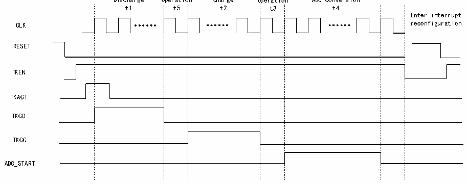

<!-- source-page: 148 -->

[← p.147](0147.md) · [index](../README.md) · [PDF p.148](https://ch32-riscv-ug.github.io/CH32V205/datasheet_en/CH32V205RM.PDF#page=148) · [p.149 →](0149.md)

<!-- header: CH32V205 Reference Manual https://wch-ic.com -->
Operation process:  
- (1) Configure the number of preset channels and channel numbers via the ADC_SQR1/2/3 registers. Use the
SCANEN field in the R32_TKEY_CTRL register to enable the TKEY channel scan function; use the SCANNUM  
field to configure the number of channels to be scanned (which must match the number of preset channels); and  
use the SCANIE field to enable the scan completion interrupt.  
- (2) Configure the CX channel (one channel) via the SELCX field in the R32_CAP_CFG register, and configure
the CS channel (select one channel) via the SELCS field.  
- (3) Enable the drive mask function via the DRVEN field in the R32_DRV_CFG register (DRVEN=1), and
configure the channels to be masked via the DRVOUTSEL field (DRVOUTSEL[15:0]=0xFFFF).  
- (4) Configure the channel selection bit using the CHSEL field of the R32_TKEY_CTRL register (CHSEL=1), and
configure the charge transfer mode using the MODE field (MODE=0).  
- (5) Configure the switch transition times (t5 and t3) using the TKSW field of the R32_TRANS_CFG register;
configure the number of charge transfers (N) using the TRANSN field; and configure the touch button capacitance  
charging time (t2) and charge transfer time (t4) using the TRANSCC field.  
- (6) Enable DMA via the DMA field (DMA=1) in the ADC_CTLR2 register; enable external trigger conversion for
the regular channel via the EXTTRIG field (EXTTRIG=1); configure the external trigger event for the regular  
channel conversion via the EXTSEL field (EXTSEL=110); the REGUSEL field configures the trigger source  
(REGUSEL=1), and the ADON field (ADON=1) enables the ADC (using the standard channel as an example, the  
injection channel is configured as: JEXTTRIG=1, JEXTSEL=110, INJESEL=1).  
- (7) Enable TKEY via the TKEN field (TKEN=1) in the R32_TKEY_CTRL register; the TKACT field (TKACT=1)
serves as a control bit to trigger TKEY to begin operation.  

### 13.1.4 Current Source Charging Mode

Figure 13-4 Current source charging mode timing diagram  
 <!-- rendered from the PDF; verify at https://ch32-riscv-ug.github.io/CH32V205/datasheet_en/CH32V205RM.PDF#page=148 -->

Switching Switching  
Discharge Operation Charge Operation ADC conversion  

🖼 Text parsed from the figure above

t1 t5 t2 t3 t4  
Enter interrupt  
CLK reconfiguration  
RESET  
TKEN  
TKACT  
TKCD  
TKCC  
ADC_START  

<em>Note: The current-source charging mode supports only single-channel conversions. Configure the channel to be</em>  
<em>converted as the first entry in the ADC module’s rule group sequence, and initiate the conversion via software.</em>  
Operation process:  
- (1) Configure the CS channel (select a channel) using the SELCS field in the R32_CAP_CFG register.
- (2) Enable the drive mask function using the DRVEN field in the R32_DRV_CFG register (DRVEN=1), and
configure the channels to be masked using the DRVOUTSEL field (DRVOUTSEL[15:0]=0xFFFF).  
<!-- image: p148-draw-image-00001 bbox=[515.88, 783.6, 534.96, 793.8] -->
<!-- footer: V1.2 124 -->
