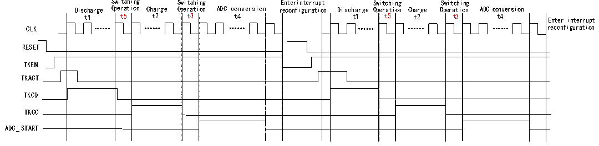

<!-- source-page: 149 -->

[← p.148](0148.md) · [index](../README.md) · [PDF p.149](https://ch32-riscv-ug.github.io/CH32V205/datasheet_en/CH32V205RM.PDF#page=149) · [p.150 →](0150.md)

<!-- header: CH32V205 Reference Manual https://wch-ic.com -->
- (3) Configure the channel selection bit via the CHSEL field of the R32_TKEY_CTRL register (CHSEL=1), and
configure the current-source charging mode via the MODE field (MODE=1).  
- (4) Configure the switching times (t3 and t5) using the TKSW field in the R32_TRANS_CFG register.
- (5) Configure the charging time (t2) using the TKCC field of the R32_TKEY_CDCC register, and configure the
discharging time (t1) using the TKCD field. t4 is the ADC sampling time, which can be configured for the  
corresponding channel using the ADC_SAMPTR1 and ADC_SAMPTR2 registers.  
- (6) Enable external trigger conversion for the regular channel via the EXTTRIG field in the ADC_CTLR2 register
(EXTTRIG=1), and configure the external trigger event for the regular channel conversion via the EXTSEL field  
(EXTSEL=110), the REGUSEL field configures the trigger source (REGUSEL=1), and the ADON field  
(ADON=1) enables the ADC (using the standard channel as an example, the injection channel is configured as:  
JEXTTRIG=1, JEXTSEL=110, INJESEL=1).  
- (7) Enable TKEY by setting the TKEN field (TKEN=1) in the R32_TKEY_CTRL register; the TKACT field
(TKACT=1) serves as the control bit to trigger TKEY to begin operation.  
- (8) Wait for the EOC (End of Conversion) flag in the ADC status register to be set to 1, then read the ADC data
register to obtain the conversion value. If the ADC interrupt is enabled, the system will enter the interrupt.  

### 13.1.5 Current Source Charging Mode Auto-scan Mode

Figure 13-4 Current source charging mode auto-scan mode timing diagram  
 <!-- rendered from the PDF; verify at https://ch32-riscv-ug.github.io/CH32V205/datasheet_en/CH32V205RM.PDF#page=149 -->

🖼 Text parsed from the figure above

Switching Switching Enterinterrupt Switching Switching  
Discharge Operation Charge Operation ADC conversion reconfiguration Discharge Operation Charge Operation ADC conversion  
t1 t5 t2 t3 t4 t1 t5 t2 t3 t4 Enter interrupt  
CLK reconfiguration  
RESET  
TKEN  
TKAC T  
TKCD  
TKC C  
ADC_START  

Operation process:  
- (1) Configure the number of preset channels and channel numbers via the ADC_SQR1/2/3 registers. Use the
SCANEN field in the R32_TKEY_CTRL register to enable the TKEY channel scanning function; use the  
SCANNUM field to configure the number of channels to be scanned (which must match the number of preset  
channels); and use the SCANIE field to enable the scan completion interrupt.  
- (2) Enable the driver mask function via the DRVEN field in the R32_DRV_CFG register (DRVEN=1). Use the
DRVOUTSEL field to configure the channels to be masked (DRVOUTSEL[15:0]=0xFFFF).  
- (3) Configure the channel selection bit via the CHSEL field in the R32_TKEY_CTRL register (CHSEL=1), and
configure the current-source charging mode via the MODE field (MODE=1).  
- (4) Configure the switching times (t3 and t5) using the TKSW field in the R32_TRANS_CFG register.
- (5) Configure the charging time (t2) via the TKCC field of the R32_TKEY_CDCC register, and the discharging
time (t1) via the TKCD field. t4 is the ADC sampling time, which can be configured for the corresponding  
channel via the ADC_SAMPTR1 and ADC_SAMPTR2 registers.  
- (6) Enable DMA via the DMA field (DMA=1) in the R32_ADC_CTLR2 register; enable external trigger
conversion for the regular channel via the EXTTRIG field (EXTTRIG=1); configure the external trigger event for  
the regular channel’s conversion via the EXTSEL field (EXTSEL=110); the REGUSEL field configures the  
trigger source (REGUSEL=1), and the ADON field (ADON=1) enables the ADC (using the regular channel as an  
<!-- image: p149-draw-image-00001 bbox=[515.88, 783.6, 534.96, 793.8] -->
<!-- footer: V1.2 125 -->
