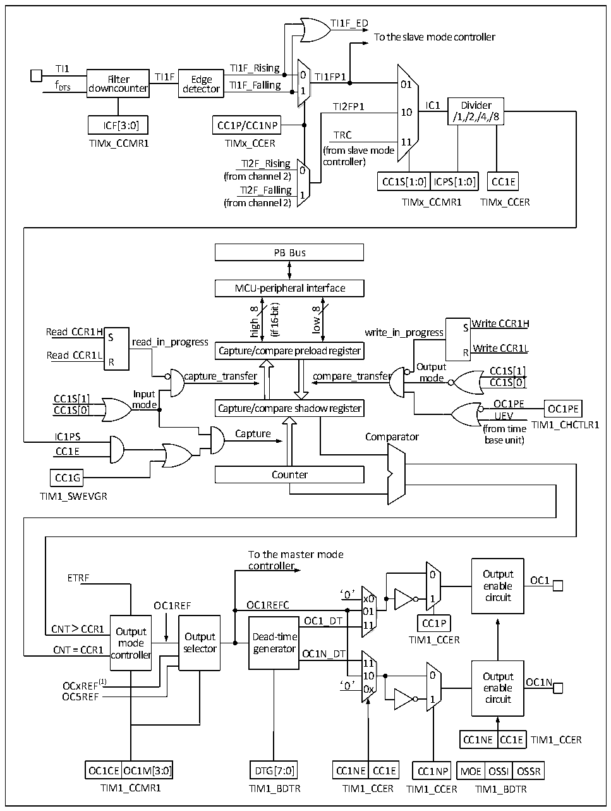

<!-- source-page: 160 -->

[← p.159](0159.md) · [index](../README.md) · [PDF p.160](https://ch32-riscv-ug.github.io/CH32V205/datasheet_en/CH32V205RM.PDF#page=160) · [p.161 →](0161.md)

<!-- header: CH32V205 Reference Manual https://wch-ic.com -->

Figure 14-3 Structure block diagram of compare/capture channel  
 <!-- rendered from the PDF; verify at https://ch32-riscv-ug.github.io/CH32V205/datasheet_en/CH32V205RM.PDF#page=160 -->

🖼 Text parsed from the figure above

TI1F_ED  
To the slave mode controller  
<!-- image: p160-draw-image-00002 inside the figure -->
TI1 TI1F_Rising  
Filter TI1F Edge 0 TI1FP1  
f DTS downcounter detector TI1F_Falling 1 01  
TI2FP1 IC1 Divider  
10  
/1,/2,/4,/8  
ICF[3:0] CC1P/CC1NP  
TRC  
TIMx_CCMR1 TIMx_CCER 11  
(from slave mode  
TI2F_Rising controller)  
0  
(from channel 2)  
CC1S[1:0] ICPS[1:0] CC1E  
TI2F_Falling  
1  
(from channel 2) TIMx_CCMR1 TIMx_CCER  
PB Bus  
MCU-peripheral interface  
16-bit)  
8  
8  
wol Write CCR1H  
high  
Read CCR1H write_in_progress S S  
(if  
read_in_progress  
Write CCR1L Read CCR1L R  
Capture/compare preload register  
R  
Output CC1S[1]  
capture_transfer compare_transfer mode  
CC1S[0]  
Input  
CC1S[1]  
CC1S[0] mode OC1PE OC1PE  
Capture/compare shadow register  
UEV  
TIM1_CHCTLR1  
(from time  
IC1PS Capture Comparator base unit)  
CC1E  
CC1G Counter  
TIM1_SWEVGR  
To the master mode  
controller  
ETRF 0 Output OC1  
enable  
<!-- image: p160-draw-image-00003 inside the figure -->
‘0’ x0 1 circuit  
OC1REF OC1REFC  
01  
Output selector  
D  Dead-time generator  
<!-- image: p160-draw-image-00004 inside the figure -->
11  
10 0 Output  
OCxREF(1) ‘0’ 0x enable OC1N  
OC5REF 1 circuit  
CC1NE  CC1E  
OC1CE  OC1M[3:0  
CC1NE  CC1E  
MOE  OSSI  OSSR  
OC1CEOC1M[3:0] DTG[7:0] CC1NE CC1E CC1NP MOE OSSI OSSR  
TIM1_CCMR1 TIM1_BDTR TIM1_CCER TIM1_CCER TIM1_BDTR  

The block diagram of the compare/capture channel is as shown in Figure 14-3. After the signal is inputted from  
the channel x pin, it can be selected as TIx (the source of TI1 may be more than CH1. See the timer structure  
block diagram 14-1). Take TI1 as the example: TI1 passes through the filter (ICF[3:0]) to generate TI1F, and then  
is divided into TI1F_Rising and TI1F_Falling after passing through the edge detector. These 2 signals are selected  
<!-- image: p160-draw-image-00001 bbox=[515.88, 783.6, 534.96, 793.8] -->
<!-- footer: V1.2 136 -->
