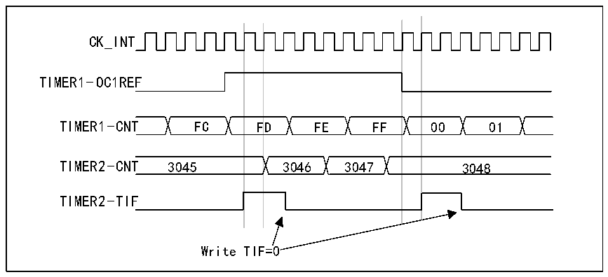

<!-- source-page: 171 -->

[← p.170](0170.md) · [index](../README.md) · [PDF p.171](https://ch32-riscv-ug.github.io/CH32V205/datasheet_en/CH32V205RM.PDF#page=171) · [p.172 →](0172.md)

<!-- header: CH32V205 Reference Manual https://wch-ic.com -->
In this example Timer 2 is enabled by comparing the output of Timer 1 with 1. Timer 2 counts according to the  
divided internal clock only when OC1REF of Timer 1 is high. The clock frequency of both counters is based on  
CK_INT by prescaler performing a 3-way frequency (fCK_CNT=fCK_INT/3).  
1) Configure timer 1 in main mode and send its output compare 1 reference signal (OC1REF) as trigger output  
(MMS=100 in R16_TIM1_CR2 register).  
2) Configure Timer 1 for OC1REF waveform (R16_TIM1_CCMR1 register).  
3) Configure Timer 2 to receive an input trigger from Timer 1 (TS=000 in R16_TIM2_SMCFGR register).  
4) Configure Timer 2 to gated mode (SMS=101 in the R16_TIM2_SMCFGR register).  
5) Enable Timer 2 by writing a &quot;1&quot; to the CEN bit (R16_TIM2_CTLR1 register).  
6) Enable Timer 1 by writing &quot;1&quot; to the CEN bit (R16_TIM1_CTLR1 register).  
<em>Note: The clock of Counter 2 is not synchronized with Counter 1, this mode only affects the counter enable signal</em>  
<em>of Timer 2.</em>  

Figure 14-11 Gating Timer 2 using OC1REF of Timer 1  
 <!-- rendered from the PDF; verify at https://ch32-riscv-ug.github.io/CH32V205/datasheet_en/CH32V205RM.PDF#page=171 -->

🖼 Text parsed from the figure above

CK_INT  
F  FD  
TIMER1-OC1REF  
TIMER2-TIF  
Write TIF=0  

The counter and prescaler of timer 2 are not initialized before start-up. Therefore counting starts from the  
respective current value. Before starting Timer 1, both timers can be counted from the specified value by resetting  
them. This makes it possible to write any desired value into the timer counter. Both timers can be easily reset by  
software using the UG bit in the R16_TIMx_SWEVGR register.  
In the next example, timer 1 is synchronized with timer 2. Timer 1 is in master mode and counts from 0. Timer 2  
is in slave mode and counts from 0xE7. Both timers have the same prescale ratio. When timer 1 is disabled by  
writing &quot;0&quot; to the CEN bit in the R16_TIM1_CTLR1 register, timer 2 will stop:  
1) Configure Timer 1 in main mode and send its output compare 1 reference signal (OC1REF) as the trigger  
output (MMS=100 in the R16_TIM1_CTLR2 register).  
2) Configure Timer 1 for the OC1REF waveform (R16_TIM1_CHCTLR1 register).  
3) Configure Timer 2 to receive an input trigger from Timer 1 (TS=000 in R16_TIM2_SMCFGR register).  
4) Configure Timer 2 to gated mode (SMS=101 in the R16_TIM2_SMCFGR register).  
5) Reset Timer 1 by writing &quot;1&quot; to the UG bit (R16_TIM1_SWEVGR register).  
6) Reset Timer 2 by writing &quot;1&quot; to the UG bit (R16_TIM2_SWEVGR register).  
7) Initialize Timer 2 to 0xE7 by writing &quot;0xE7&quot; to Timer 2&#x27;s counter (R16_TIM2_CNTL).  
8) Enable Timer 2 by writing &quot;1&quot; to the CEN bit (R16_TIM2_CTLR1 register).  
9) Enable Timer 1 by writing &quot;1&quot; to the CEN bit (R16_TIM1_CTLR1 register).  
<!-- image: p171-draw-image-00001 bbox=[515.88, 783.6, 534.96, 793.8] -->
<!-- footer: V1.2 147 -->
