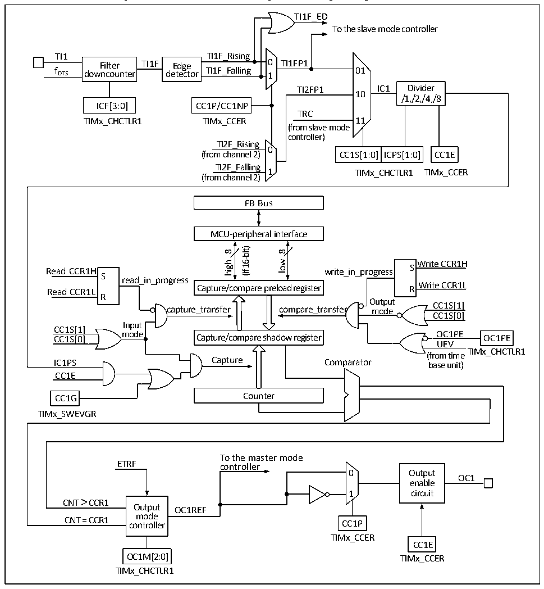

<!-- source-page: 201 -->

[← p.200](0200.md) · [index](../README.md) · [PDF p.201](https://ch32-riscv-ug.github.io/CH32V205/datasheet_en/CH32V205RM.PDF#page=201) · [p.202 →](0202.md)

<!-- header: CH32V205 Reference Manual https://wch-ic.com -->
output part comparator and output control. The block diagram of the compare/capture is as shown in Figure 15-3.  

Figure 15-3 Structure block diagram of compare/capture channel  
 <!-- rendered from the PDF; verify at https://ch32-riscv-ug.github.io/CH32V205/datasheet_en/CH32V205RM.PDF#page=201 -->

🖼 Text parsed from the figure above

TI1F_ED  
To the slave mode controller  
TI1 TI1F_Rising  
Filter TI1F Edge 0 TI1FP1  
f DTS downcounter detector TI1F_Falling 1 01  
TI2FP1 IC1 Divider  
10  
/1,/2,/4,/8  
ICF[3:0] CC1P/CC1NP  
TRC  
TIMx_CHCTLR1 TIMx_CCER 11  
(from slave mode  
controller)  
TI2F_Rising  
0  
CC1S[1:0]  ICPS[1:0]  
(from channel 2) CC1S[1:0] ICPS[1:0] CC1E  
TI2F_Falling  
1 TIMx_CCER  
TIMx_CHCTLR1  
(from channel 2)  
PB Bus  
MCU-peripheral interface  
16-bit)  
8  
8  
low  
high  
Write CCR1H  
Read CCR1H write_in_progress S S  
(if  
read_in_progress  
Write CCR1L Read CCR1L R  
Capture/compare preload register  
R  
Output  
CC1S[1]  
capture_transfer compare_transfer mode  
CC1S[0]  
Input  
CC1S[1]  
mode OC1PE CC1S[0] OC1PE  
Capture/compare shadow register  
UEV  
TIMx_CHCTLR1  
(from time  
IC1PS Capture Comparator base unit)  
CC1E  
CC1G Counter  
TIMx_SWEVGR  
To the master mode  
ETRF controller  
0 Output  
OC1  
enable  
1 circuit  
CNT &gt; CCR1  
Output OC1REF  
mode  
CNT = CCR1 controller CC1P  
TIMx_CCER  
CC1E  
OC1M[2:0] TIMx_CCER  
TIMx_CHCTLR1  

After the signal is input from the channel x pin, it can be selected as TIx (the source of TI1 may be more than CH1.  
See Figure 15-1 timer block diagram). Take TI1 as the example: TI1 passes through the filter (ICF[3:0]) to  
generate TI1F, and then is divided into TI1F_Rising and TI1F_Falling after passing through the edge detector.  
These 2 signals are selected (CC1P) to generate TI1FP1, and TI1FP1 and TI2FP1 from channel 2 are sent to CC1S  
together to be selected as IC1, and then sent to the compare/capture register after going through the ICPS  
frequency division.  
The compare/capture register is composed of preload register and shadow register, and only the preload register is  
operated during reading and writing. In the capture mode, the capture occurs on the shadow register, and then  
copied to the preload register; in the comparison mode, the content of the preload register is copied to the shadow  
register, and then the content of the shadow register is compared with the core counter (CNT).  
<!-- image: p201-draw-image-00001 bbox=[515.88, 783.6, 534.96, 793.8] -->
<!-- footer: V1.2 177 -->
