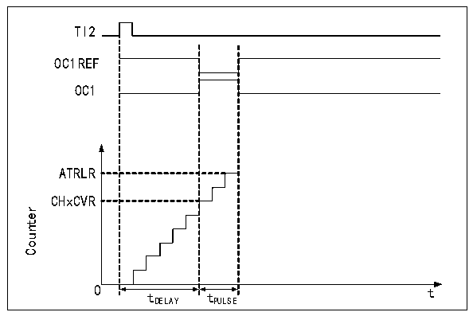

<!-- source-page: 204 -->

[← p.203](0203.md) · [index](../README.md) · [PDF p.204](https://ch32-riscv-ug.github.io/CH32V205/datasheet_en/CH32V205RM.PDF#page=204) · [p.205 →](0205.md)

<!-- header: CH32V205 Reference Manual https://wch-ic.com -->
when an update event occurs, it is necessary to set the UG bit to initialize all registers before the core counter  
starts counting. In the PWM mode, the core counter and the compare/capture register are always being compared.  
According to the CMS bit, the timer can output edge-aligned or center-aligned PWM signals.  
● Edge alignment  
When the edge alignment is used, the core counter counts up or down. In the scenario of PWM mode 1, when the  
value of the core counter is greater than that of the compare/capture register, OCxREF will rise to be high; when  
the value of the core counter is less than the compare/capture register (such as When the core counter increases to  
the value of R16_TIMx_ATRLR and returns to all 0s), OCxREF drops to low.  
● Central alignment  
When the center-aligned mode is used, the core counter will run in a mode where up counting and down counting  
are performed alternately, and OCxREF performs rising and falling jumps when the values of the core counter and  
the compare/capture register are consistent. However, in 3 types of central alignment mode, the bit setting timing  
of comparison flag is different somewhat. When the center-alignment mode is used, it is the best to generate a  
software update flag (set the UG bit) before starting the core counter.  

### 15.3.6 Single Pulse Mode

The single pulse mode can be used to respond to a specific event to generate a pulse after a delay. The delay and  
pulse width are programmable. Setting the OPM bit can make the core counter stop when the next update event  
UEV is generated (the counter turns over to 0).  

Figure 15-4 Event generation and pulse response  
 <!-- rendered from the PDF; verify at https://ch32-riscv-ug.github.io/CH32V205/datasheet_en/CH32V205RM.PDF#page=204 -->

🖼 Text parsed from the figure above

TI2  
OC1REF  
OC1  
ATRLR  
CHxCVR  
Counter  
0 tDELAY tPULSE t  

As shown in Figure 15-4, it is necessary to detect the beginning of a rising edge on the TI2 input pin. After  
delaying Tdelay, a positive pulse of length Tpulse will be generated on OC1:  
1) Set TI2 as trigger. Set the CC2S field to 01b and map TI2FP2 to TI2; set the CC2P bit to 0b and set TI2FP2 to  
rising edge detection; set the TS field to 110b and set TI2FP2 as the trigger source; set the SMS field to 110b, and  
TI2FP2 is used to start the counter;  
2) Tdelay is defined by the value of the compare/capture register, and Tpulse is determined by the value of the  
auto-reload value register and the value of the compare/capture register.  

### 15.3.7 Encoder Mode

The encoder mode is a typical application of the timer. It can be used to access the dual-phase output of the  
<!-- image: p204-draw-image-00001 bbox=[515.88, 783.6, 534.96, 793.8] -->
<!-- footer: V1.2 180 -->
