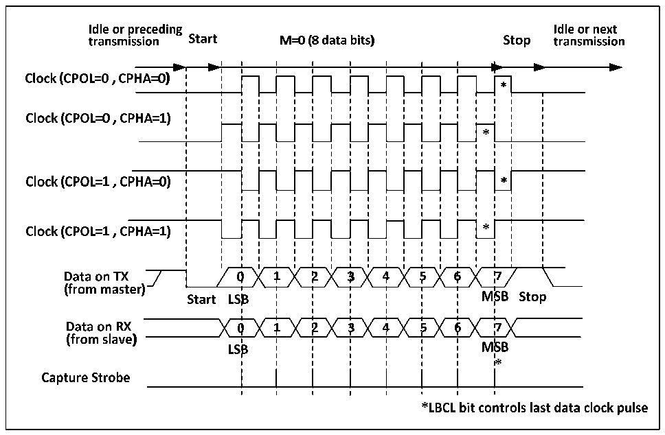
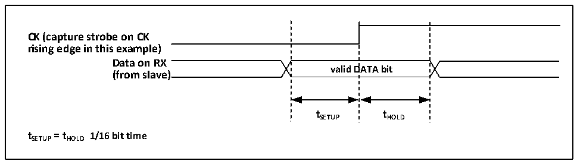

<!-- source-page: 242 -->

[← p.241](0241.md) · [index](../README.md) · [PDF p.242](https://ch32-riscv-ug.github.io/CH32V205/datasheet_en/CH32V205RM.PDF#page=242) · [p.243 →](0243.md)

<!-- header: CH32V205 Reference Manual https://wch-ic.com -->

Figure 17-2 Example of USART clock timing (M=0)  
 <!-- rendered from the PDF; verify at https://ch32-riscv-ug.github.io/CH32V205/datasheet_en/CH32V205RM.PDF#page=242 -->

🖼 Text parsed from the figure above

<!-- image: p242-draw-image-00013 inside the figure -->
<!-- image: p242-draw-image-00002 inside the figure -->
<!-- image: p242-draw-image-00004 inside the figure -->
<!-- image: p242-draw-image-00008 inside the figure -->
<!-- image: p242-draw-image-00011 inside the figure -->
<!-- image: p242-draw-image-00012 inside the figure -->
<!-- image: p242-draw-image-00010 inside the figure -->
<!-- image: p242-draw-image-00007 inside the figure -->
<!-- image: p242-draw-image-00009 inside the figure -->
<!-- image: p242-draw-image-00005 inside the figure -->
<!-- image: p242-draw-image-00014 inside the figure -->
<!-- image: p242-draw-image-00003 inside the figure -->
<!-- image: p242-draw-image-00006 inside the figure -->
<!-- image: p242-draw-image-00016 inside the figure -->
<!-- image: p242-draw-image-00024 inside the figure -->
<!-- image: p242-draw-image-00015 inside the figure -->
<!-- image: p242-draw-image-00017 inside the figure -->
<!-- image: p242-draw-image-00019 inside the figure -->
<!-- image: p242-draw-image-00021 inside the figure -->
<!-- image: p242-draw-image-00023 inside the figure -->
<!-- image: p242-draw-image-00018 inside the figure -->
<!-- image: p242-draw-image-00022 inside the figure -->
<!-- image: p242-draw-image-00020 inside the figure -->
<!-- image: p242-draw-image-00100 inside the figure -->
<!-- image: p242-draw-image-00026 inside the figure -->
<!-- image: p242-draw-image-00036 inside the figure -->
<!-- image: p242-draw-image-00034 inside the figure -->
<!-- image: p242-draw-image-00044 inside the figure -->
<!-- image: p242-draw-image-00025 inside the figure -->
<!-- image: p242-draw-image-00035 inside the figure -->
<!-- image: p242-draw-image-00027 inside the figure -->
<!-- image: p242-draw-image-00037 inside the figure -->
<!-- image: p242-draw-image-00029 inside the figure -->
<!-- image: p242-draw-image-00039 inside the figure -->
<!-- image: p242-draw-image-00031 inside the figure -->
<!-- image: p242-draw-image-00041 inside the figure -->
<!-- image: p242-draw-image-00033 inside the figure -->
<!-- image: p242-draw-image-00043 inside the figure -->
<!-- image: p242-draw-image-00028 inside the figure -->
<!-- image: p242-draw-image-00038 inside the figure -->
<!-- image: p242-draw-image-00032 inside the figure -->
<!-- image: p242-draw-image-00042 inside the figure -->
<!-- image: p242-draw-image-00030 inside the figure -->
<!-- image: p242-draw-image-00040 inside the figure -->
<!-- image: p242-draw-image-00101 inside the figure -->
<!-- image: p242-draw-image-00046 inside the figure -->
<!-- image: p242-draw-image-00054 inside the figure -->
<!-- image: p242-draw-image-00045 inside the figure -->
<!-- image: p242-draw-image-00047 inside the figure -->
<!-- image: p242-draw-image-00051 inside the figure -->
<!-- image: p242-draw-image-00053 inside the figure -->
<!-- image: p242-draw-image-00049 inside the figure -->
<!-- image: p242-draw-image-00099 inside the figure -->
<!-- image: p242-draw-image-00098 inside the figure -->
<!-- image: p242-draw-image-00048 inside the figure -->
<!-- image: p242-draw-image-00052 inside the figure -->
<!-- image: p242-draw-image-00050 inside the figure -->
<!-- image: p242-draw-image-00097 inside the figure -->
<!-- image: p242-draw-image-00056 inside the figure -->
<!-- image: p242-draw-image-00064 inside the figure -->
<!-- image: p242-draw-image-00055 inside the figure -->
<!-- image: p242-draw-image-00057 inside the figure -->
<!-- image: p242-draw-image-00061 inside the figure -->
<!-- image: p242-draw-image-00059 inside the figure -->
<!-- image: p242-draw-image-00063 inside the figure -->
<!-- image: p242-draw-image-00058 inside the figure -->
<!-- image: p242-draw-image-00062 inside the figure -->
<!-- image: p242-draw-image-00060 inside the figure -->
<!-- image: p242-draw-image-00079 inside the figure -->
<!-- image: p242-draw-image-00083 inside the figure -->
<!-- image: p242-draw-image-00078 inside the figure -->
<!-- image: p242-draw-image-00081 inside the figure -->
<!-- image: p242-draw-image-00082 inside the figure -->
<!-- image: p242-draw-image-00084 inside the figure -->
<!-- image: p242-draw-image-00065 inside the figure -->
<!-- image: p242-draw-image-00080 inside the figure -->
<!-- image: p242-draw-image-00077 inside the figure -->
<!-- image: p242-draw-image-00066 inside the figure -->
<!-- image: p242-draw-image-00067 inside the figure -->
<!-- image: p242-draw-image-00068 inside the figure -->
<!-- image: p242-draw-image-00093 inside the figure -->
<!-- image: p242-draw-image-00095 inside the figure -->
<!-- image: p242-draw-image-00074 inside the figure -->
<!-- image: p242-draw-image-00075 inside the figure -->
<!-- image: p242-draw-image-00069 inside the figure -->
<!-- image: p242-draw-image-00087 inside the figure -->
<!-- image: p242-draw-image-00091 inside the figure -->
<!-- image: p242-draw-image-00086 inside the figure -->
<!-- image: p242-draw-image-00089 inside the figure -->
<!-- image: p242-draw-image-00090 inside the figure -->
<!-- image: p242-draw-image-00092 inside the figure -->
<!-- image: p242-draw-image-00088 inside the figure -->
<!-- image: p242-draw-image-00085 inside the figure -->
<!-- image: p242-draw-image-00070 inside the figure -->
<!-- image: p242-draw-image-00071 inside the figure -->
<!-- image: p242-draw-image-00072 inside the figure -->
<!-- image: p242-draw-image-00094 inside the figure -->
<!-- image: p242-draw-image-00076 inside the figure -->
<!-- image: p242-draw-image-00096 inside the figure -->
<!-- image: p242-draw-image-00073 inside the figure -->
<!-- image: p242-draw-image-00102 inside the figure -->
<!-- image: p242-draw-image-00103 inside the figure -->

Figure 17-3 Data sample hold time  
 <!-- rendered from the PDF; verify at https://ch32-riscv-ug.github.io/CH32V205/datasheet_en/CH32V205RM.PDF#page=242 -->

🖼 Text parsed from the figure above

valid  DATA bit  
<strong>CK (capture strobe on CK</strong>  
<strong>rising edge in this example)</strong>  
<strong>Data on RX</strong>  
<strong>(from slave)</strong>  
<strong>tSETUP tHOLD</strong>  
<strong>tSETUP= tHOLD 1/16 bit time</strong>  

## 17.5 1-wire Half-duplex Mode

The half-duplex mode supports the use of a single pin (only TX pin) to receive and transmit, and the TX pin and  
RX pin are connected inside the chip.  
To enable half-duplex mode, set HDSEL bit in the control register 3 (R16_USARTx_CTLR3), but you need to  
disable LIN mode, smartcard mode, infrared mode and synchronous mode at the same time, i.e., to ensure that the  
SCEN, CLKEN and IREN bits are in the reset status. These 3 bits are in the control register 2 and the control  
register 3 (R16_USARTx_CTLR2 and R16_USARTx_CTLR3).  
After setting to half-duplex mode, it is needed to set the TX IO port to open-drain output high mode. When TE bit  
is set, the data will be sent out as long as the data is written to the data register. Special attention shall be paid to  
the fact that bus conflicts may occur when multiple devices use a single bus to transmit and receive in half-duplex  
<!-- image: p242-draw-image-00001 bbox=[515.88, 783.6, 534.96, 793.8] -->
<!-- footer: V1.2 218 -->
