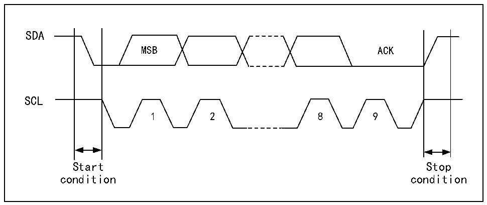
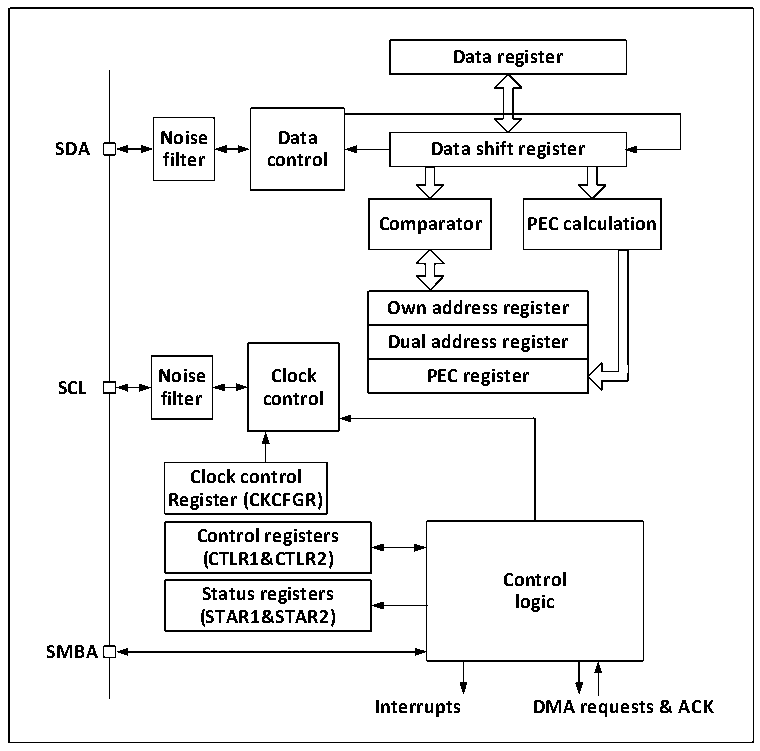

<!-- source-page: 256 -->

[← p.255](0255.md) · [index](../README.md) · [PDF p.256](https://ch32-riscv-ug.github.io/CH32V205/datasheet_en/CH32V205RM.PDF#page=256) · [p.257 →](0257.md)

<!-- header: CH32V205 Reference Manual https://wch-ic.com -->

Figure 18-1 I2C timing diagram  
 <!-- rendered from the PDF; verify at https://ch32-riscv-ug.github.io/CH32V205/datasheet_en/CH32V205RM.PDF#page=256 -->

🖼 Text parsed from the figure above

SDA  
MSB ACK  
SCL  
1 2 8 9  
Start Stop  
condition condition  

For normal use, the correct clock must be input to I2C. In the standard mode, the minimum input clock is 2MHz,  
while the minimum input clock is 4MHz in the fast mode.  
Figure 18-2 shows the block diagram of I2C.  

Figure 18-2 I2C block diagram  
 <!-- rendered from the PDF; verify at https://ch32-riscv-ug.github.io/CH32V205/datasheet_en/CH32V205RM.PDF#page=256 -->

🖼 Text parsed from the figure above

<strong>Data register</strong>  
<strong>Noise Data</strong>  
<strong>SDA Data shift register</strong>  
<strong>filter control</strong>  
<strong>Comparator PEC calculation</strong>  
Own address register  Dual address register  PEC register  
<strong>Noise Clock PEC register</strong>  
<strong>SCL</strong>  
<strong>filter control</strong>  
<strong>Clock control</strong>  
<strong>Register (CKCFGR)</strong>  
<strong>Control registers</strong>  
<strong>(CTLR1&amp;CTLR2)</strong>  
<strong>Control</strong>  
<strong>Status registers</strong>  
<strong>logic</strong>  
<strong>(STAR1&amp;STAR2)</strong>  
<strong>SMBA</strong>  
<strong>Interrupts DMA requests &amp; ACK</strong>  

<!-- image: p256-draw-image-00001 bbox=[515.88, 783.6, 534.96, 793.8] -->
<!-- footer: V1.2 232 -->
