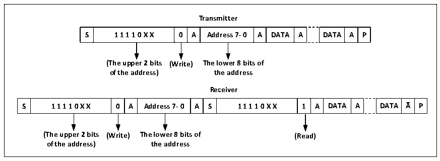

<!-- source-page: 258 -->

[← p.257](0257.md) · [index](../README.md) · [PDF p.258](https://ch32-riscv-ug.github.io/CH32V205/datasheet_en/CH32V205RM.PDF#page=258) · [p.259 →](0259.md)

<!-- header: CH32V205 Reference Manual https://wch-ic.com -->

Figure 18-3 Master receive/transmits data in 10-bit address mode  
 <!-- rendered from the PDF; verify at https://ch32-riscv-ug.github.io/CH32V205/datasheet_en/CH32V205RM.PDF#page=258 -->

🖼 Text parsed from the figure above

<strong>Transmitter</strong>  
S  1 1 1 1 0 X X  0  A  Address 7- 0  A  DATA  A  DATA  A  P  
<strong>(The upper 2 bits (Write) The lower 8 bits of</strong>  
<strong>of the address) the address</strong>  
<strong>Receiver</strong>  
S  1 1 1 1 0 X X  0  A  Address 7- 0  A  S  1 1 1 1 0 X X  1  A  DATA  A  DATA  A  P  
<strong>(The upper 2 bits (Write) The lower 8 bits of (Read)</strong>  
<strong>of the address) the address</strong>  

When transmitting mode, the shift register inside the main device transmits data from the data register to the SDA  
line. When the main device receives the ACK, the TxE of the status register 1 (R16_I2Cx_STAR1) is set, and an  
interrupt occurs if the ITEVTEN and ITBUFEN are set. Writing data to the data register clears the TxE bit. If the  
TxE bit is set and no new data is written to the data register before the last data is sent, then the BTF bit will be set,  
the SCL will remain low until it is cleared, and after reading the R16_I2Cx_STAR1, writing data to the data  
register will clear the BTF bit.  
In the receiving mode, the I2C module receives data from the SDA line and writes it into the data register through  
the shift register. After each byte, if the ACK bit is set, the I2C module will issue a low level of reply, while the  
RxNe bit will be set, and if ITEVTEN and ITBUFEN are set, there will be an interruption. If the RxNE is set and  
the original data is not read before the new data is received, the BTF bit will be set, the SCL will remain low  
before clearing the BTF, and reading the R16_I2Cx_STAR1 and then reading the data register will clear the BTF  
bit.  
When the master device ends sending data, it will actively send an end event, that is, setting the STOP bit. In the  
receive mode, the master device needs to NAK at the answer location of the last data bit. Note that after the NAK  
is generated, the I2C module will switch to slave mode.  

## 18.4 Slave Mode

From the mode, the I2C module can recognize its own address and broadcast call address. The software can  
control the identification of broadcast call addresses on or off. Once the start event is detected, the I2C module  
compares the SDA data through the shift register with its own address (the number of bits depends on ENDUAL  
and ADDMODE) or the broadcast address (when ENGC is set). If there is a mismatch, it will be ignored until a  
new start event is generated. If it matches the header sequence, an ACK signal is generated and waits for the  
address of the second byte; if the address of the second byte also matches, or if the address of the whole segment  
matches in the case of a 7-bit address, then:  
First an ACK reply is generated; the ADDR bit is set, and if the ITEVTEN bit is set, there will be a corresponding  
interrupt.  
If you are using dual-address mode (the ENDUAL bit is set), you also need to read the DUALF bit to determine  
which address the host is calling.  
The slave mode defaults to receive mode, and when the last bit of the received header sequence is 1, or the last bit  
of the 7-bit address is 1 (depending on whether the header sequence is received for the first time or a normal 7-bit  
<!-- image: p258-draw-image-00001 bbox=[515.88, 783.6, 534.96, 793.8] -->
<!-- footer: V1.2 234 -->
