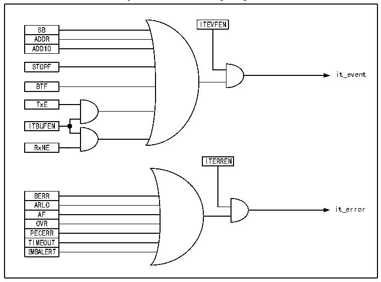

<!-- source-page: 261 -->

[← p.260](0260.md) · [index](../README.md) · [PDF p.261](https://ch32-riscv-ug.github.io/CH32V205/datasheet_en/CH32V205RM.PDF#page=261) · [p.262 →](0262.md)

<!-- header: CH32V205 Reference Manual https://wch-ic.com -->

Figure 18-4 I2C interrupt request  
 <!-- rendered from the PDF; verify at https://ch32-riscv-ug.github.io/CH32V205/datasheet_en/CH32V205RM.PDF#page=261 -->

🖼 Text parsed from the figure above

ITEVFEN  
SB  ADDR  ADD10  
STOPF  
it_event  
BTF  
TxE  
ITBUFEN  
RxNE  
<!-- image: p261-draw-image-00002 inside the figure -->
ITERREN  
BERR  ARLO  ARAFLO  OAVFR  PECERR  TIMEOUT  SMBALERT  
it_error  
OVR  

## 18.9 DMA

DMA can be used to receive/transmit bulk data. When DMA is used, the ITBUFEN bit of the control register  
cannot be set.  
● DMA is used for transmission  
The DMA mode can be activated by setting the DMAEN bit in the CTLR2 register. As long as the TxE bit is set,  
the data can be loaded into the I2C data register from the set memory by DMA. The following settings are  
required to allocate channels for I2C.  
1) Set the I2Cx_DATAR register address to the DMA_PADDRx register, and set the memory address in the  
DMA_MADDRx register, so that the data will be sent from the memory to the I2Cx_DATAR register after  
each TxE event.  
2) Set the required number of transferred bytes in the DMA_CNTRx register. After each TxE event, this value will  
be reduced progressively.  
3) The channel priority is configured using the PL[0:1] bits in the DMA_CFGRx register.  
4) Set the DIR bit in the DMA_CFGRx register, and it can be configured to issue an interrupt request according to  
application requirements when the entire transmission is half or wholly completed.  
5) Activate the channel by setting the EN bit in the DMA_CFGRx register.  
When the number of data transfer bytes set in the DMA controller has been completed, the DMA controller will  
send an EOT/EOT_1 signal indicating the end of the transmission to the I2C interface. When the interrupt is  
allowed, a DMA interrupt will be generated.  
● DMA is used for reception  
After the DMAEN bit in the CTLR2 register is set, DMA receiver mode can be started. When DMA is used for  
reception, DMA transfers the data in the data register to the preset memory area. The following steps are required  
<!-- image: p261-draw-image-00001 bbox=[515.88, 783.6, 534.96, 793.8] -->
<!-- footer: V1.2 237 -->
