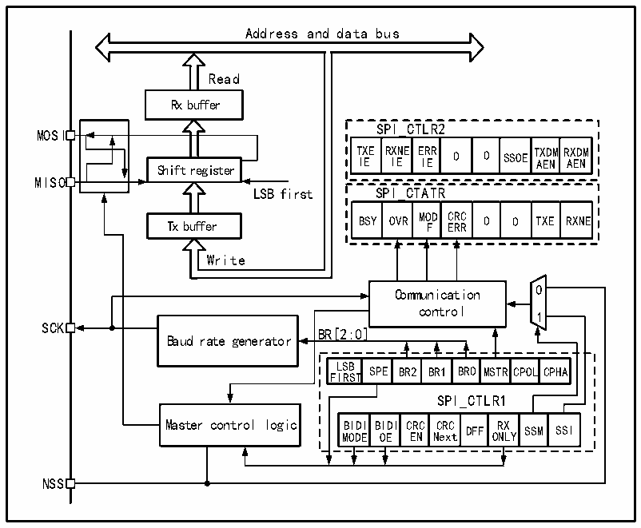

<!-- source-page: 274 -->

[← p.273](0273.md) · [index](../README.md) · [PDF p.274](https://ch32-riscv-ug.github.io/CH32V205/datasheet_en/CH32V205RM.PDF#page=274) · [p.275 →](0275.md)

<!-- header: CH32V205 Reference Manual https://wch-ic.com -->

## 19.2 SPI Functional Description

### 19.2.1 Overview

Figure 19-1 SPI structure diagram  
 <!-- rendered from the PDF; verify at https://ch32-riscv-ug.github.io/CH32V205/datasheet_en/CH32V205RM.PDF#page=274 -->

🖼 Text parsed from the figure above

Address and data bus  
Read  
Rx buffer  
SPI_CTLR2  
MOSI  
T I X E E R I X E NE E I R E R 0 0 SSOE T A X E D N MR A X E D N M  
Shift register  
MISO  
LSB first SPI_CTATR  
Tx buffer BSY OVR MO F D E C R R R C 0 0 TXE RXNE  
Write  
Communication 0  
control  
1  
SCK  
BR[2:0]  LSBFIRST  SPE  BR2  BR1  BR0  MSTR  RCPOL  LCPHA  
Baud rate generator  
SPI_CTLR1  
BIDIMODE  BIDIOE  CRCEN  CRCNext  DFF  RXONL  X LY SSM  SSI  
NSS  

As can be seen from Figure 19-1, the 4 pins related to SPI are MISO, M0SI, SCK and NSS. The MISO pin is the  
data input pin when the SPI module works in the master mode; it is the data output pin when it works in the slave  
mode. When the MOSI pin works in master mode, it is a data output pin; when it works in slave mode, it is a data  
input pin. SCK is the clock pin, the clock signal is always output by the master, and the slave receives the clock  
signal and synchronizes data transmission and reception. The NSS pin is a chip select pin and has the following  
uses:  
1) NSS is controlled by software: At this time, SSM is set, and the internal NSS signal is determined by SSI to  
output high or low. This situation is generally used in SPI master mode;  
2) NSS is controlled by hardware: When the NSS output is enabled, i.e., when SSOE is set, the NSS pin will be  
actively pulled down when the SPI host sends the output outward, and a hardware error will be generated if the  
NSS pin cannot be successfully pulled down and pulled down, indicating that there are other host devices on the  
main line that are communicating; SSOE If it is not set, it can be used in multi-master mode. If it is pulled low, it  
will be forced into slave mode, and the MSTR bit will be automatically cleared.  
The working mode of the SPI can be configured through CPHA and CPOL. If CPHA is set, it means that the  
module samples the data on the second edge of the clock, and the data is latched. If CPHA is not set, it means that  
the SPI module samples on the first edge of the clock, and the data is latched. CPOL indicates whether the clock  
remains high or low when there is no data.  
<!-- image: p274-draw-image-00001 bbox=[515.88, 783.6, 534.96, 793.8] -->
<!-- footer: V1.2 250 -->
