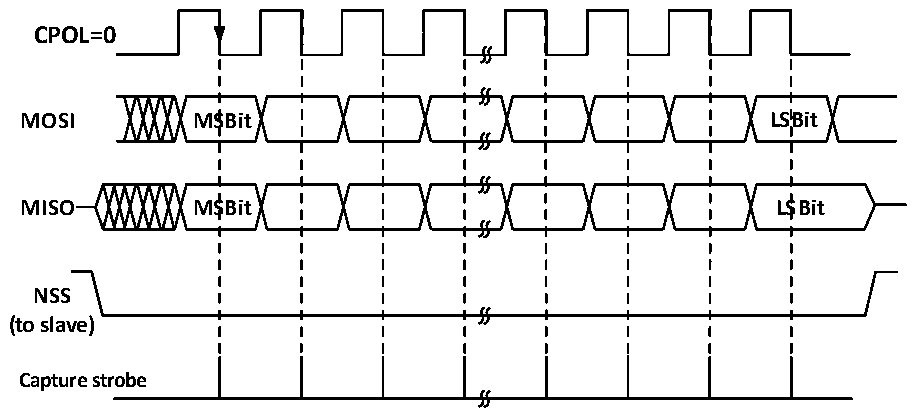
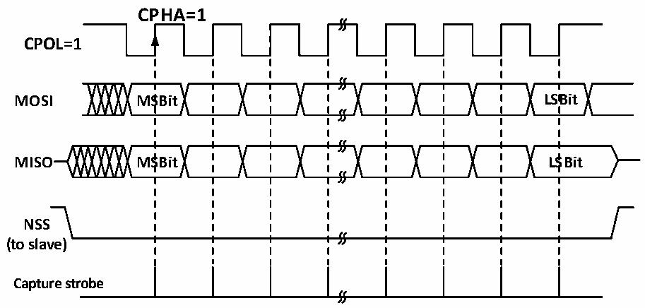

<!-- source-page: 279 -->

[← p.278](0278.md) · [index](../README.md) · [PDF p.279](https://ch32-riscv-ug.github.io/CH32V205/datasheet_en/CH32V205RM.PDF#page=279) · [p.280 →](0280.md)

<!-- header: CH32V205 Reference Manual https://wch-ic.com -->

Figure 19-8 SPI slave mode read/write mode 2  
 <!-- rendered from the PDF; verify at https://ch32-riscv-ug.github.io/CH32V205/datasheet_en/CH32V205RM.PDF#page=279 -->

# MODE 2

# CPHA=1

🖼 Text parsed from the figure above

<strong>CPOL=0</strong>  
<strong>MOSI MSBit LSBit</strong>  
<strong>MISO MSBit LSBit</strong>  
<strong>NSS</strong>  
<strong>(to slave)</strong>  
<strong>Capture strobe</strong>  

Figure 19-9 SPI slave mode read/write mode 3  
 <!-- rendered from the PDF; verify at https://ch32-riscv-ug.github.io/CH32V205/datasheet_en/CH32V205RM.PDF#page=279 -->

# MODE 3

🖼 Text parsed from the figure above

CPHA=1  
<strong>CPOL=1</strong>  
<strong>MOSI MSBit LSBit</strong>  
<strong>MISO MSBit LSBit</strong>  
<strong>NSS</strong>  
<strong>(to slave)</strong>  
<strong>Capture strobe</strong>  

### 19.2.4 Simplex Mode

The SPI interface can work in half-duplex mode, that is, the master device uses the MOSI pin, and the slave  
device uses the MISO pin for communication. When using half-duplex communication, BIDIMODE needs to be  
set, and BIDIOE is used to control the transmission direction.  
Setting the RXONLY bit in normal full-duplex mode can set the SPI module to receive-only simplex mode. After  
RXONLY is set, a data pin will be released. The pins released in master mode and slave mode are not the same. It  
is also possible to ignore the received data and set the SPI to transmit-only mode.  
<!-- image: p279-draw-image-00001 bbox=[515.88, 783.6, 534.96, 793.8] -->
<!-- footer: V1.2 255 -->
