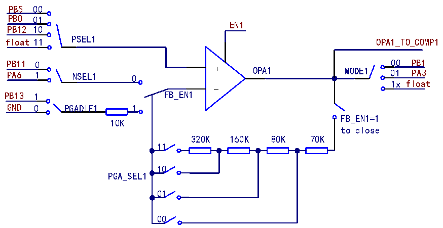
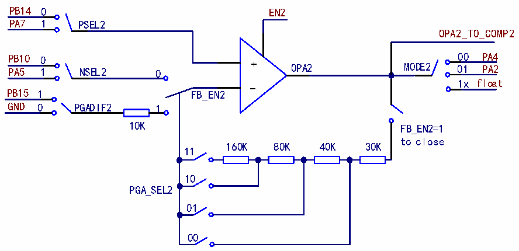

<!-- source-page: 336 -->

[← p.335](0335.md) · [index](../README.md) · [PDF p.336](https://ch32-riscv-ug.github.io/CH32V205/datasheet_en/CH32V205RM.PDF#page=336) · [p.337 →](0337.md)

<!-- header: CH32V205 Reference Manual https://wch-ic.com -->

Figure 23-1 OPA1 Structure Diagram  
 <!-- rendered from the PDF; verify at https://ch32-riscv-ug.github.io/CH32V205/datasheet_en/CH32V205RM.PDF#page=336 -->

🖼 Text parsed from the figure above

PB5 00  
PB0 01  
EN1  
PB12 10  
PSEL1  
float 11 OPA1_TO_COMP1  
PB11 0 00 PB1  
PA6 1 NSEL1 0 + OPA1 MODE1 01 PA3  
1x float  
-  
PB13 1 FB_EN1  
GND 0 PGADIF1 1  
FB_EN1=1  
10K  
to close  
320K 160K 80K 70K  
11  
10  
PGA_SEL1  
01  
00  

In the OPA_CTLR2 register: Set bit EN2 to enable OPA2; set bit PSEL2 to select the positive input channel of  
OPA2; set bit NSEL2 to select the negative input channel of OPA2; set bit FB_EN2 to enable the internal PGA  
mode of OPA2; set bits PGA_SEL2[1:0] to select the gain of PGA2; Set bit PGADIF2 to select whether the PGA2  
output bias voltage is supplied externally or grounded internally; set bit HS2 to enable high-speed mode, which  
increases the slew rate; set bits MODE2[1:0] to select the OPA2 output channel.  

Figure 23-2 OPA2 Structure Diagram  
 <!-- rendered from the PDF; verify at https://ch32-riscv-ug.github.io/CH32V205/datasheet_en/CH32V205RM.PDF#page=336 -->

🖼 Text parsed from the figure above

PB14 0 EN2  
PA7 1 PSEL2  
OPA2_TO_COMP2  
PB10 0 00 PA4  
PA5 1 NSEL2 0 + OPA2 MODE2 01 PA2  
1x float  
-  
PB15 1 FB_EN2  
GND 0 PGADIF2 1  
10K FB_EN2=1  
to close  
160K 80K 40K 30K  
11  
10  
PGA_SEL2  
01  
00  

### 23.2.2 OPA1 Positive Input Polling

The OPA&#x27;s P-side can be selected from OPA_P0, OPA_P1, or OPA_P2. The number of polling channels can be  
configured via the POLL1_NUM bit in the OPA_CTLR1 register, with a maximum of 3 channels selectable. The  
OPA&#x27;s polling function enables the sequential, timed selection of OPA_P0, OPA_P1, and OPA_P2, cycling  
through all P-pins; The OPA polling sequence can be set by configuring the POLL_CHx bits in the OPA_CTLR1  
register, and the OPA1 positive-edge polling can be enabled by setting the POLL_EN1 bit.  
When using the P-side polling function, the OPA1 settling time must be configured appropriately to ensure that  
sampling occurs only after the OPA1 output has stabilized. The OPA1 settling time can be configured via the  
<!-- image: p336-draw-image-00001 bbox=[515.88, 783.6, 534.96, 793.8] -->
<!-- footer: V1.2 312 -->
