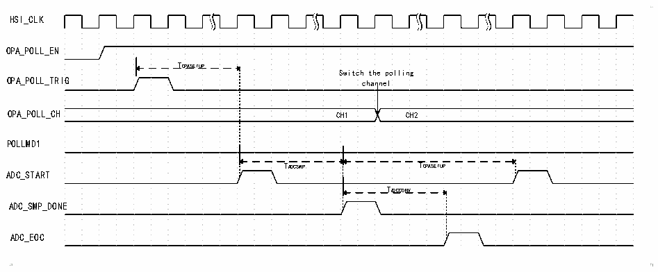
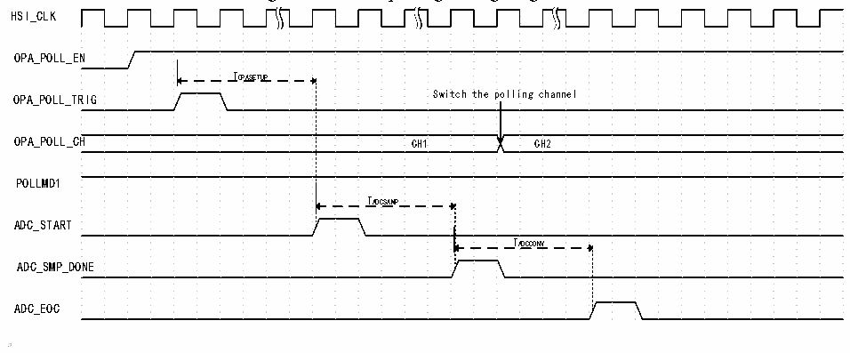

<!-- source-page: 337 -->

[← p.336](0336.md) · [index](../README.md) · [PDF p.337](https://ch32-riscv-ug.github.io/CH32V205/datasheet_en/CH32V205RM.PDF#page=337) · [p.338 →](0338.md)

<!-- header: CH32V205 Reference Manual https://wch-ic.com -->
STCFG1 bit in the OPA_CFGR1 register.  

Figure 23-3 OPA polling timing diagram 1  
 <!-- rendered from the PDF; verify at https://ch32-riscv-ug.github.io/CH32V205/datasheet_en/CH32V205RM.PDF#page=337 -->

🖼 Text parsed from the figure above

HSI_CLK  
OPA_POLL_EN  
TOPASETUP  
Switch the polling  
OPA_POLL_TRIG channel  
OPA_POLL_CH CH1 CH2  
POLLMD1  
TADCSMP TOPASETUP  
ADC_START  
TADCCONV  
ADC_SMP_DONE  
ADC_EOC  

TOPASETUP: OPA setup time;  
TADCSMP: ADC sampling time;  
TADCCONV: ADC conversion time.  
As shown in Figure 23-3, when bit 1 of POLLMD1 is set to 0, after the configured polling trigger event occurs,  
the ADC begins sampling following the execution of TOPASETUP. Once sampling is complete, the polling channel  
switches, and after another execution of TOPASETUP(Note: The OPA setup time must be longer than the ADC  
conversion time), the next ADC sampling begins, repeating the process following ADC sampling.  

Figure 23-4 OPA polling timing diagram 2  
 <!-- rendered from the PDF; verify at https://ch32-riscv-ug.github.io/CH32V205/datasheet_en/CH32V205RM.PDF#page=337 -->

🖼 Text parsed from the figure above

HSI_CLK  
OPA_POLL_EN  
TOPASETUP  
OPA_POLL_TRIG Switch the polling channel  
OPA_POLL_CH CH1 CH2  
POLLMD1  
TADCSAMP  
ADC_START  
TADCCONV  
ADC_SMP_DONE  
ADC_EOC  

TOPASETUP: OPA setup time;  
TADCSMP: ADC sampling time;  
TADCCONV: ADC conversion time.  
As shown in Figure 23-4, when the POLLMD1 bit is set to 1, after a configured polling trigger event occurs, the  
ADC begins sampling following the TOPASETUP cycle. Once sampling is complete, the polling channel switches;  
the process is repeated after the next polling trigger event occurs.  
Recommendations for Use: In practical applications, if the ADC conversion time exceeds the OPA settling time, it  
is recommended to set the POLLMD1 bit to 1 and use it in conjunction with the ADC scan mode; if the ADC  
conversion time is less than the OPA settling time, it is recommended to set the POLLMD1 bit to 0 and use it in  
<!-- image: p337-draw-image-00001 bbox=[515.88, 783.6, 534.96, 793.8] -->
<!-- footer: V1.2 313 -->
