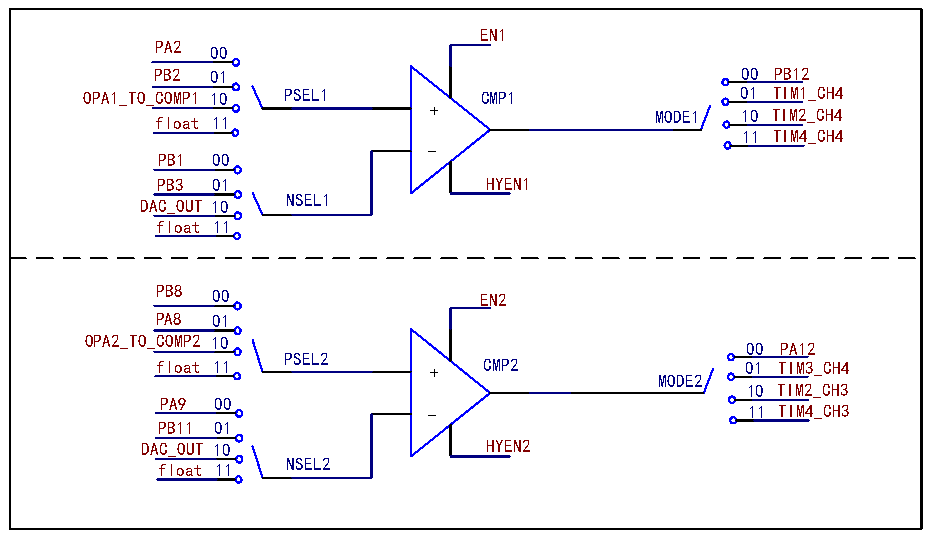

<!-- source-page: 339 -->

[← p.338](0338.md) · [index](../README.md) · [PDF p.339](https://ch32-riscv-ug.github.io/CH32V205/datasheet_en/CH32V205RM.PDF#page=339) · [p.340 →](0340.md)

<!-- header: CH32V205 Reference Manual https://wch-ic.com -->

Figure 23-5 CMP Structure Diagram  
 <!-- rendered from the PDF; verify at https://ch32-riscv-ug.github.io/CH32V205/datasheet_en/CH32V205RM.PDF#page=339 -->

🖼 Text parsed from the figure above

EN1  
PA2 00  
PB2 01 00 PB12  
OPA1_TO_COMP1 10 PSEL1 CMP1 01 TIM1_CH4  
+ MODE1 10 TIM2_CH4  
float 11  
11 TIM4_CH4  
-  
PB1 00  
PB3 01 HYEN1  
DAC_OUT 10 NSEL1  
float 11  
PB8 00 EN2  
PA8 01  
OPA2_TO_COMP2 10  
00 PA12  
float 11 PSEL2 + CMP2 01 TIM3_CH4  
MODE2  
10 TIM2_CH3  
PA9 00  
11 TIM4_CH3  
PB11 01  
DAC_OUT 10 HYEN2  
NSEL2  
float 11  

<em>Note: If the comparator output uses a timed channel, capture via timer is used to view the comparator output</em>  
<em>status.</em>  

### 23.2.7 CMP Interrupt

External Interrupt (EXTI) Line Exclusive to Comparator - EXTI22 (COMP Wake-Up Event), which generates an  
interrupt or event, can be used for wake-up in SLEEP, STOP mode 1 and STOP mode 2.  
The required conditions when using external interrupt wake-up are:  
1) Enable PVD function;  
2) Configure the event enable bit (EXTI_EVENR) of the corresponding external interrupt channel;  
3) Configure the comparator output level trigger edge;  
3) Configure the EXTI interrupt in the core&#x27;s PFIC to ensure that it can respond correctly.  
4) Enable CMP.  
<em>Note: The digital filtering function needs to be turned off in STOP mode.</em>  
When using events, the required conditions are:  
1) Configure the event enable bit (EXTI_EVENR) of the corresponding external interrupt channel;  
2) Configure the comparator output level trigger edge;  
3) Enable CMP.  
Select the wake-up source for the CMP output signal by configuring WKUP_MD[1:0].  

<!-- p339-table-001 (table-23-1@1) -->
<table><caption>Table 23-1 Wake-up source selection for CMP output signals</caption><tr><th>Set WKUP_MD[1:0]</th><th>01</th><th>10</th><th>11</th><th>00</th></tr><tr><td>Wake-up CMP signal</td><td>CMP1 output</td><td>CMP2 output</td><td style="text-align:left">Any change of CMP1 and CMP2.</td><td>invalid</td></tr></table>

<em>Note: When the CMP will generate an interrupt request, the corresponding Interrupt Line 22 flag bit will also be</em>  
<em>set. Writing a 1 to the flag bit clears it.</em>  
<!-- image: p339-draw-image-00001 bbox=[515.88, 783.6, 534.96, 793.8] -->
<!-- footer: V1.2 315 -->
