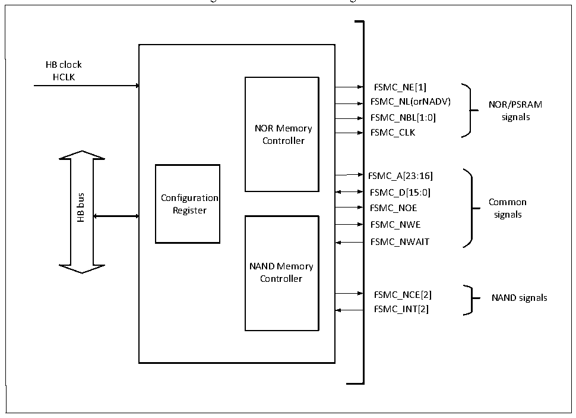

<!-- source-page: 350 -->

[← p.349](0349.md) · [index](../README.md) · [PDF p.350](https://ch32-riscv-ug.github.io/CH32V205/datasheet_en/CH32V205RM.PDF#page=350) · [p.351 →](0351.md)

<!-- header: CH32V205 Reference Manual https://wch-ic.com -->

# Chapter 24 Flexible Static Memory Controller (FSMC)

<strong><em>The module description in this chapter only applies to CH32V205 microcontroller products.</em></strong>  
The flexible static memory controller (FSMC) supports a variety of static memory types and rich storage  
operation methods, and can expand different types of large-capacity static memory according to the needs of  
system applications.  

## 24.1 Main Features

• Support to operate SRAM, ROM, NOR FLASH and PSRAM  
• Support NAND FLASH operation, and built-in hardware ECC, can detect up to 8KByte data  
• Support for synchronous device operation, such as PSRAM  
• Support 8bit or 16bit data bus width  
• Timing signals can be programmed by software  

## 24.2 Functional Description

### 24.2.1 Module Structure

FSMC mainly includes HB bus interface, NOR memory controller, NAND memory controller and external device  
interface.  

Figure 24-1 FSMC block diagram  
 <!-- rendered from the PDF; verify at https://ch32-riscv-ug.github.io/CH32V205/datasheet_en/CH32V205RM.PDF#page=350 -->

🖼 Text parsed from the figure above

HB clock  
HCLK  
FSMC_NE[1]  
FSMC_NL(orNADV) NOR/PSRAM  
FSMC_NBL[1:0] signals  
NOR Memory FSMC_CLK  
Controller  
FSMC_A[23:16]  
FSMC_D[15:0]  
bus  
Configuration  
Common  
Register FSMC_NOE  
signals  
HB  
FSMC_NWE  
FSMC_NWAIT  
NAND Memory  
Controller  
FSMC_NCE[2] NAND signals  
FSMC_INT[2]  

<!-- image: p350-draw-image-00001 bbox=[515.88, 783.6, 534.96, 793.8] -->
<!-- footer: V1.2 326 -->
