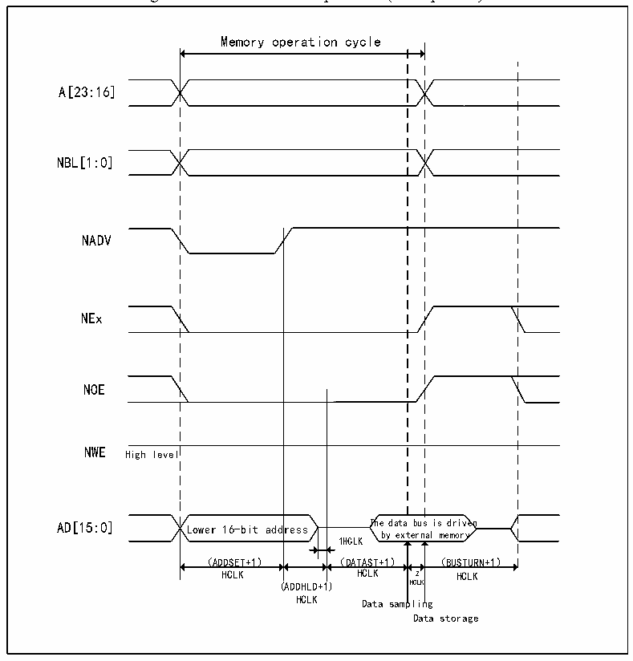

<!-- source-page: 354 -->

[← p.353](0353.md) · [index](../README.md) · [PDF p.354](https://ch32-riscv-ug.github.io/CH32V205/datasheet_en/CH32V205RM.PDF#page=354) · [p.355 →](0355.md)

<!-- header: CH32V205 Reference Manual https://wch-ic.com -->

> ⬆ **Table continued** — rendered in full at [page 353](0353.md). <!-- p354-table-001 -->

#### 24.2.3.3 NOR/PSRAM Timing Diagram of Asynchronous Transfer Address/Data Multiplexing

Note the following for asynchronous static memory (NOR FLASH and PSRAM) operations:  
● When extended mode is enabled, read and write operations to memory using modes A, B, C, and D can be  
mixed.  

Figure 24-3 Mode 1 read operation (Multiplexed)  
 <!-- rendered from the PDF; verify at https://ch32-riscv-ug.github.io/CH32V205/datasheet_en/CH32V205RM.PDF#page=354 -->

🖼 Text parsed from the figure above

Memory operation cycle  
A[23:16]  
NBL[1:0]  
NADV  
NEx  
NOE  
NWE High level  
dress  
AD[15:0] Lower 16-bit address The data bus is driven  
by external memory  
1HCLK  
（ADDSET+1） （DATAST+1） （BUSTURN+1）  
HCLK HCLK 2 HCLK  
(ADDHLD+1) HCLK  
HCLK Data sampling  
Data storage  

<!-- image: p354-draw-image-00001 bbox=[515.88, 783.6, 534.96, 793.8] -->
<!-- footer: V1.2 330 -->
