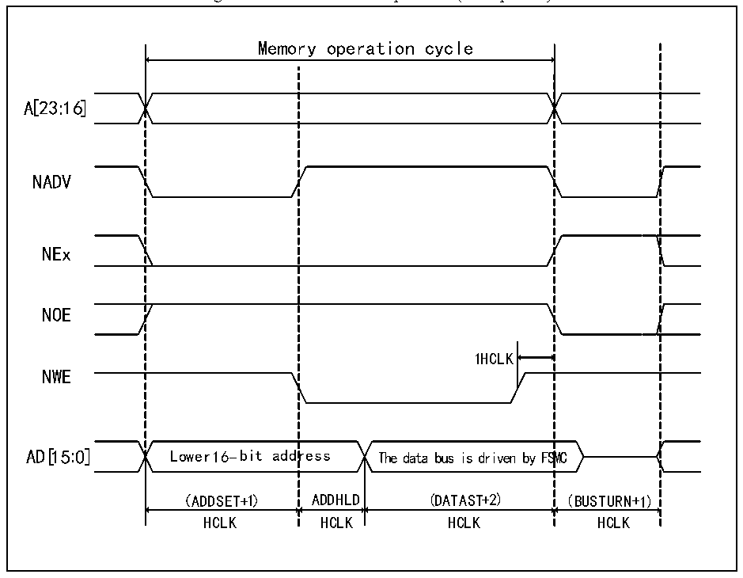

<!-- source-page: 360 -->

[← p.359](0359.md) · [index](../README.md) · [PDF p.360](https://ch32-riscv-ug.github.io/CH32V205/datasheet_en/CH32V205RM.PDF#page=360) · [p.361 →](0361.md)

<!-- header: CH32V205 Reference Manual https://wch-ic.com -->

Figure 24-8 Mode B write operation (Multiplexed)  
 <!-- rendered from the PDF; verify at https://ch32-riscv-ug.github.io/CH32V205/datasheet_en/CH32V205RM.PDF#page=360 -->

🖼 Text parsed from the figure above

Memory operation cycle  
A[23:16]  
NADV  
NEx  
Lower 16-bit addr （ADDSET+1）  
NOE  
1HCLK  
NWE  
（ADDSET+1） ADDHLD (DATAST+2) (BUSTURN+1)  
HCLK HCLK HCLK HCLK  

<!-- p360-table-002 (table-24-13@1) pages 360-361 -->
<table><caption>Table 24-13 Mode B FSMC_BCR1 bit field</caption><tr><th>Bitx</th><th>Name</th><th>Configuration Value</th></tr><tr><td>[31:20]</td><td>Reserved</td><td>0x000</td></tr><tr><td>19</td><td>CBURSTRW</td><td>0x0</td></tr><tr><td>[18:16]</td><td>Reserved</td><td>0x0</td></tr><tr><td>15</td><td>ASYNCWAIT</td><td style="text-align:left">It is 1 if the memory supports this function, otherwise it is 0.</td></tr><tr><td>14</td><td>EXTMOD</td><td>0x1</td></tr><tr><td>13</td><td>WAITEN</td><td>0x0</td></tr><tr><td>12</td><td>WREN</td><td>Set as needed</td></tr><tr><td>11</td><td>WAITCFG</td><td>No effect</td></tr><tr><td>10</td><td>Reserved</td><td>0x0</td></tr><tr><td>9</td><td>WAITPOL</td><td>When bit15 is 1, it is meaningful.</td></tr><tr><td>8</td><td>BURSTEN</td><td>0x0</td></tr><tr><td>7</td><td>Reserved</td><td>0x1</td></tr><tr><td>6</td><td>FACCEN</td><td>0x1</td></tr><tr><td>[5:4]</td><td>MWID</td><td>Set as needed</td></tr><tr><td>[3:2]</td><td>MTYP</td><td>0x2(NOR FLASH)</td></tr><tr><td>1</td><td>MUXEN</td><td>0x1</td></tr><tr><td>0</td><td>MBKEN</td><td>0x1</td></tr></table>

<!-- image: p360-draw-image-00001 bbox=[515.88, 783.6, 534.96, 793.8] -->
<!-- footer: V1.2 336 -->
