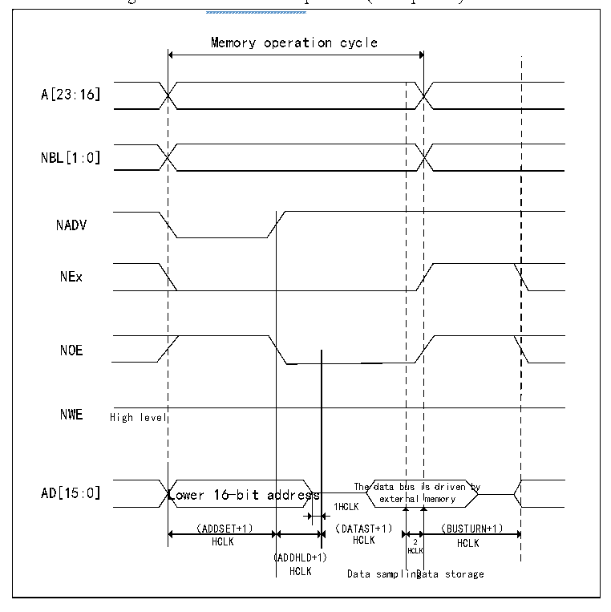

<!-- source-page: 362 -->

[← p.361](0361.md) · [index](../README.md) · [PDF p.362](https://ch32-riscv-ug.github.io/CH32V205/datasheet_en/CH32V205RM.PDF#page=362) · [p.363 →](0363.md)

<!-- header: CH32V205 Reference Manual https://wch-ic.com -->

Figure 24-9 Mode C read operation (Multiplexed)  
 <!-- rendered from the PDF; verify at https://ch32-riscv-ug.github.io/CH32V205/datasheet_en/CH32V205RM.PDF#page=362 -->

🖼 Text parsed from the figure above

<!-- image: p362-draw-image-00002 inside the figure -->
Memory operation cycle  
Lower 16-bit ad （ADDSET+1）  ddress  is driven by memory （BUSTURN+1）  ddres  us i nal  ss  
<!-- image: p362-draw-image-00003 inside the figure -->
A[23:16]  
<!-- image: p362-draw-image-00004 inside the figure -->
NBL[1:0]  
<!-- image: p362-draw-image-00005 inside the figure -->
<!-- image: p362-draw-image-00006 inside the figure -->
NADV  
<!-- image: p362-draw-image-00007 inside the figure -->
NEx  
<!-- image: p362-draw-image-00008 inside the figure -->
NOE  
<!-- image: p362-draw-image-00009 inside the figure -->
NWE High level  
<!-- image: p362-draw-image-00010 inside the figure -->
<!-- image: p362-draw-image-00011 inside the figure -->
1HCLK  
<!-- image: p362-draw-image-00012 inside the figure -->
HCLK HCLK 2 HCLK  
(ADDHLD+1) HCLK  
<!-- image: p362-draw-image-00013 inside the figure -->
HCLK Data samplinDgata storage  

<!-- image: p362-draw-image-00001 bbox=[515.88, 783.6, 534.96, 793.8] -->
<!-- footer: V1.2 338 -->
