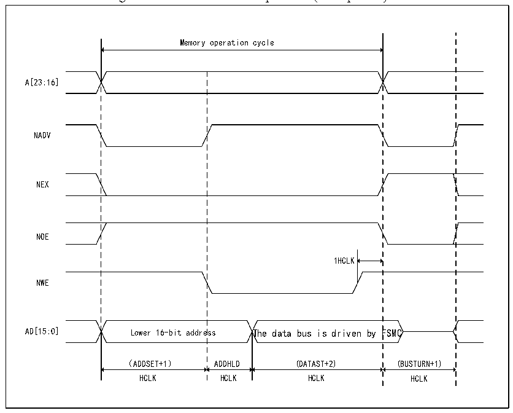

<!-- source-page: 363 -->

[← p.362](0362.md) · [index](../README.md) · [PDF p.363](https://ch32-riscv-ug.github.io/CH32V205/datasheet_en/CH32V205RM.PDF#page=363) · [p.364 →](0364.md)

<!-- header: CH32V205 Reference Manual https://wch-ic.com -->

Figure 24-10 Mode C write operation (Multiplexed)  
 <!-- rendered from the PDF; verify at https://ch32-riscv-ug.github.io/CH32V205/datasheet_en/CH32V205RM.PDF#page=363 -->

🖼 Text parsed from the figure above

Memory operation cycle  
A[23:16]  
Lower 16-bit addres  
NADV  
NEX  
NOE  
1HCLK  
NWE  
AD[15:0] Lower 16-bit address The data bus is driven by FSMC  
（ADDSET+1） ADDHLD (DATAST+2) (BUSTURN+1)  
HCLK HCLK HCLK HCLK  

<!-- p363-table-002 (table-24-16@1) -->
<table><caption>Table 24-16 Mode C FSMC_BCR1 bit field</caption><tr><th>Bitx</th><th>Name</th><th>Configuration Value</th></tr><tr><td>[31:20]</td><td>Reserved</td><td>0x000</td></tr><tr><td>19</td><td>CBURSTRW</td><td>0x0</td></tr><tr><td>[18:16]</td><td>Reserved</td><td>0x0</td></tr><tr><td>15</td><td>ASYNCWAIT</td><td style="text-align:left">It is 1 if the memory supports this function, otherwise it is 0.</td></tr><tr><td>14</td><td>EXTMOD</td><td>0x1</td></tr><tr><td>13</td><td>WAITEN</td><td>0x0</td></tr><tr><td>12</td><td>WREN</td><td>Set as needed</td></tr><tr><td>11</td><td>WAITCFG</td><td>No effect</td></tr><tr><td>10</td><td>Reserved</td><td>0x0</td></tr><tr><td>9</td><td>WAITPOL</td><td>When bit15 is 1, it is meaningful.</td></tr><tr><td>8</td><td>BURSTEN</td><td>0x0</td></tr><tr><td>7</td><td>Reserved</td><td>0x1</td></tr><tr><td>6</td><td>FACCEN</td><td>0x1</td></tr><tr><td>[5:4]</td><td>MWID</td><td>Set as needed</td></tr><tr><td>[3:2]</td><td>MTYP</td><td>0x2(NOR FLASH)</td></tr><tr><td>1</td><td>MUXEN</td><td>0x1</td></tr><tr><td>0</td><td>MBKEN</td><td>0x1</td></tr></table>

<!-- p363-table-003 (table-24-17@1) pages 363-364 -->
<table><caption>Table 24-17 Mode C FSMC_BTR1 bit field</caption><tr><th>Bitx</th><th>Name</th><th>Configuration Value</th></tr><tr><td>[31:30]</td><td>Reserved</td><td>0x0</td></tr><tr><td>[29:28]</td><td>ACCMOD</td><td>0x2</td></tr><tr><td>[27:24]</td><td>DATLAT</td><td>No effect</td></tr><tr><td>[23:20]</td><td>CLKDIV</td><td>No effect</td></tr><tr><td>[19:16]</td><td>BUSTURN</td><td>0x0</td></tr><tr><td>[15:8]</td><td>DATAST</td><td style="text-align:left">Data setup time. The read operation is (DATAST+3 HCLK). The minimum value of this bit is 1.</td></tr><tr><td>[7:4]</td><td>ADDHLD</td><td>Address hold time. (ADDHLD+1 HCLK)</td></tr><tr><td>[3:0]</td><td>ADDSET</td><td style="text-align:left">Address setup time. The read operation is (ADDSET+1 HCLK).</td></tr></table>

<!-- image: p363-draw-image-00001 bbox=[515.88, 783.6, 534.96, 793.8] -->
<!-- footer: V1.2 339 -->
