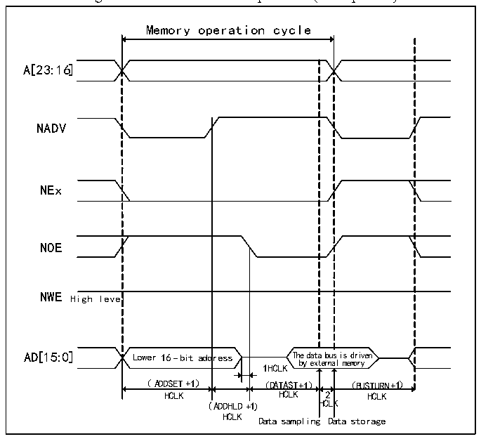
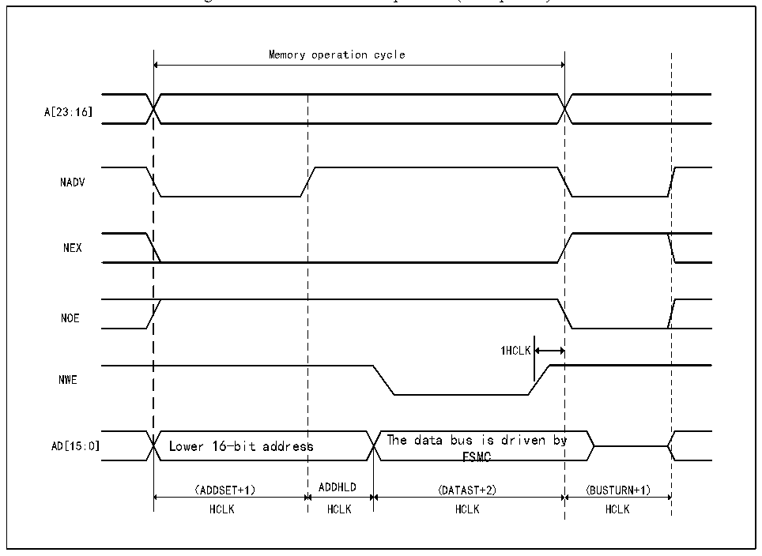

<!-- source-page: 365 -->

[← p.364](0364.md) · [index](../README.md) · [PDF p.365](https://ch32-riscv-ug.github.io/CH32V205/datasheet_en/CH32V205RM.PDF#page=365) · [p.366 →](0366.md)

<!-- header: CH32V205 Reference Manual https://wch-ic.com -->

Figure 24-11 Mode D read operation (Multiplexed)  
 <!-- rendered from the PDF; verify at https://ch32-riscv-ug.github.io/CH32V205/datasheet_en/CH32V205RM.PDF#page=365 -->

🖼 Text parsed from the figure above

Memory operation cycle  
l Lower 16-bit add （ADDSET+1）  ress  
A[23:16]  
NADV  
NEx  
NOE  
NWE High level  
HCLK HCLK 2 HCLK  
(ADDHLD+1) HCLK  
HCLK Data sampling Data storage  

Figure 24-12 Mode D write operation (Multiplexed)  
 <!-- rendered from the PDF; verify at https://ch32-riscv-ug.github.io/CH32V205/datasheet_en/CH32V205RM.PDF#page=365 -->

🖼 Text parsed from the figure above

Memory operation cycle  
A[23:16]  
NADV  
NEX  
NOE  
1HCLK  
NWE  
The data bus is driven by  
AD[15:0] Lower 16-bit address  
FSMC  
（ADDSET+1） ADDHLD (DATAST+2) (BUSTURN+1)  
HCLK HCLK HCLK HCLK  

<!-- image: p365-draw-image-00001 bbox=[515.88, 783.6, 534.96, 793.8] -->
<!-- footer: V1.2 341 -->
