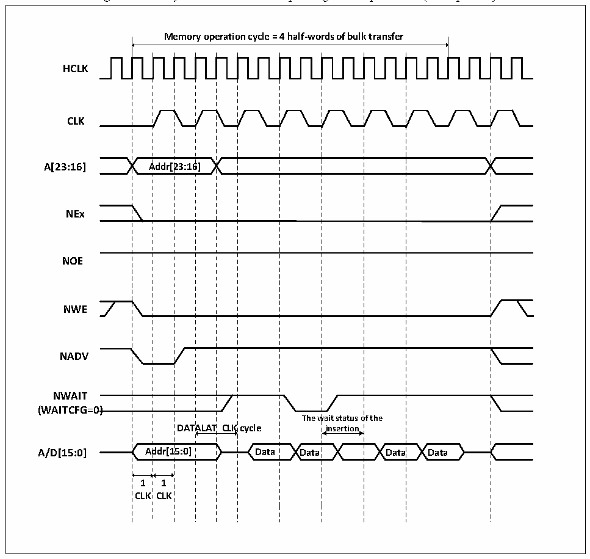

<!-- source-page: 370 -->

[← p.369](0369.md) · [index](../README.md) · [PDF p.370](https://ch32-riscv-ug.github.io/CH32V205/datasheet_en/CH32V205RM.PDF#page=370) · [p.371 →](0371.md)

<!-- header: CH32V205 Reference Manual https://wch-ic.com -->

Figure 24-14 Synchronous bus multiplexing write operations (Multiplexed)  
 <!-- rendered from the PDF; verify at https://ch32-riscv-ug.github.io/CH32V205/datasheet_en/CH32V205RM.PDF#page=370 -->

🖼 Text parsed from the figure above

<strong>Memory operation cycle = 4 half-words of bulk transfer</strong>  
Addr[23:16]  A  Addr[2  23:16  CLK  Ad  DAT  ALAT  ALAT  ddr[1  5:0]  
<strong>HCLK</strong>  
<strong>CLK</strong>  
<strong>A[23:16] Addr[23:16]</strong>  
<strong>NEx</strong>  
<strong>NOE</strong>  
<strong>NWE</strong>  
<strong>NADV</strong>  
<strong>NWAIT</strong>  
<strong>(WAITCFG=0)</strong>  
<strong>A/D[15:0] Addr[15:0] Data Data Data Data</strong>  
<strong>1 1</strong>  
<strong>CLK CLK</strong>  

<!-- p370-table-002 (table-24-24@1) pages 370-371 -->
<table><caption>Table 24-24 FSMC_BCR1 bit field (Synchronous write mode)</caption><tr><th>Bitx</th><th>Name</th><th>Configuration Value</th></tr><tr><td>[31:20]</td><td>Reserved</td><td>0x000</td></tr><tr><td>19</td><td>CBURSTRW</td><td>0x1</td></tr><tr><td>[18:16]</td><td>Reserved</td><td>0x0</td></tr><tr><td>15</td><td>ASYNCWAIT</td><td>0x0</td></tr><tr><td>14</td><td>EXTMOD</td><td>0x0</td></tr><tr><td>13</td><td>WAITEN</td><td style="text-align:left">It is 1 if the memory supports this function, 0 otherwise it is 0.</td></tr><tr><td>12</td><td>WREN</td><td>0x1</td></tr><tr><td>11</td><td>WAITCFG</td><td>0x0</td></tr><tr><td>10</td><td>Reserved</td><td>0x0</td></tr><tr><td>9</td><td>WAITPOL</td><td>Set as needed</td></tr><tr><td>8</td><td>BURSTEN</td><td>No effect</td></tr><tr><td>7</td><td>Reserved</td><td>0x1</td></tr><tr><td>6</td><td>FACCEN</td><td>Set as needed</td></tr><tr><td>[5:4]</td><td>MWID</td><td>Set as needed</td></tr><tr><td>[3:2]</td><td>MTYP</td><td>0x1</td></tr><tr><td>1</td><td>MUXEN</td><td>0x1</td></tr><tr><td>0</td><td>MBKEN</td><td>0x1</td></tr></table>

<!-- image: p370-draw-image-00001 bbox=[515.88, 783.6, 534.96, 793.8] -->
<!-- footer: V1.2 346 -->
